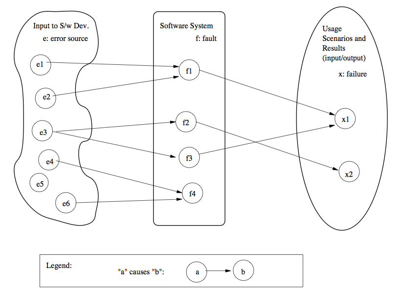
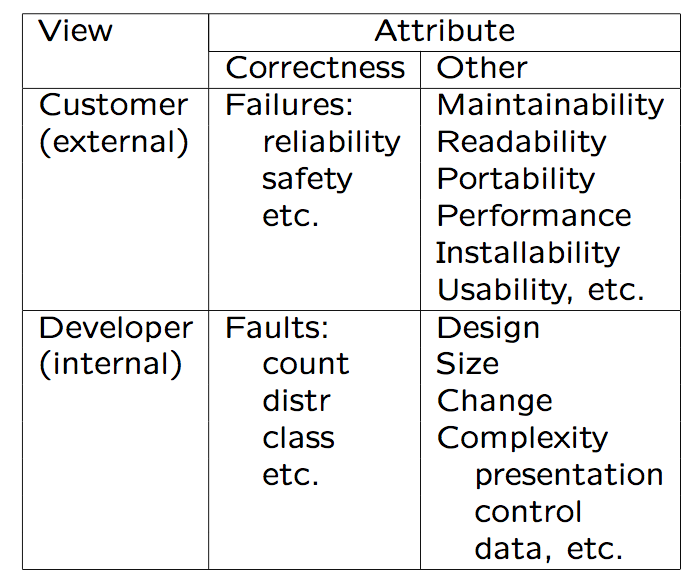

Software Quality Engineering
============================

        Testing, Quality Assurance, and Quantiable Improvement

Tian Siyuan <tiansiyuan@gmail.com>

# Chapter 2: What Is Quality?

- 	  Perspectives and Expectations

-	  Quality Frameworks and ISO-9126

-	  Correctness, Defect, and Quality

-	  A Historical Perspective

# Perspectives and Expectations

- 	  General: 

	  "good" software quality

-	  Perspectives:

	  people/subject’s view, software as object

-	  Expectations: 

	  quality characteristics & level

-	  In Kitchenham & Pfleeger (1996):

	  . Transcendental view: seen/not-defined.
	  . User view: fitness for purpose.
	  . Manufacturing view: conform to specs.
	  . Product view: inherent characteristics.
	  . Value-based view: willing to pay.

# Quality Perspectives

- 	  Perspectives: subject and object

-	  Subject: people’s perspectives

	  . external/consumer: customers and users
	  . internal/producer: developers, testers, and managers
	  . other: 3rd party, indirect users, etc.
	  . users generalized: other systems etc.
	  . focus on external/consumer side

-	  Objects of our study:

	  . software products, systems, and services
	  . stand-alone, embedded, etc.
	  . affect quality definitions/expectations

# Quality Expectations

-	 Expectations from different people

-	 External/consumer expectations:

	 . "good enough" for the price

	   	 -	 fit-for-use, doing the "right things"
		 -	 conformance, doing \things right"
		 	 -> validation and verification (V&V)

	 . customer vs user (price?)
	 . internal vs external user
	 . generalized user: other hw/sw/system/etc.

-	 Expectations for different software:

	 . general: functionality & reliability,
	 . usability: GUI/end-user/web/etc.,
	 . interoperability: embedded systems,
	 . safety: safety-critical systems, etc.

-	 Internal/producer:

	 . "good enough" for the cost

	   	 -	 mirror consumer side
		 -	 functionality & correctness via V&V

	 . cost: developers vs managers
	 . service related: maintainability
	 . interfacing units: interoperability
	 . 3rd party: modularity

-	 Different expectations for different types of
	 products and market segments too.

-	 Different QA/SQE activities needed.

# ISO-9126 Quality Framework

- 	 ISO 9126 quality characteristics:

	 . Functionality: what is needed?
	 . Reliability: function correctly.
	 . Usability: effort to use.
	 . Efficiency: resource needed.
	 . Maintainability: correct/improve/adapt.
	 . Portability: one environment to another.

-	 Impact and limitations:

	 . Characteristics into sub-characteristics
	 . Comprehensive framework
	 . Strict hierarchy -> other alternatives

# Other Quality Frameworks

- 	Adaptation of ISO-9126:

	. customized for companies

	  e.g., IBM’s CUPRIMDSO.

	. adapted to application domains

	  reliability, usability, security for Web

-	  Other quality frameworks/mega-models

	  . McCall: factors, criteria, and metrics
	  . Basili: GQM (goal-question-metric)
	  . SEI/CMM: process focus/levels
	  . Dromey: component reflects Q-attributes
	  . Defect-based view: common in industry
	    cost of defect: by Boehm, NIST, etc.

# Correctness, Defect and Quality

- 	  High quality ~ low defect

	  . intuitive notion related to correctness
	  . quality problem ~ defect impact
	  . widely accepted, but need better definitions

-	  Defect/bug definition

	  . failure: external behavior
	    deviation from expected behavior

	  . fault: internal characteristics
	    cause for failures

	  . error: incorrect/missing human action
	    error source: conceptual mistakes etc.

	  . defect: error, fault, failure collectively

	  . bug/debug: problematic terms, avoid

Correctness, Defect and Quality

-	  Relations: errors -> faults -> failures

	  not necessarily 1-1, Fig 2.1 (p.21) above

-	  Other issues:

	  . QA as dealing with defect: Chapter 3
	  . defect handling/resolution: Chapter 4

# Defining Quality in SQE

-	  Quality: views and attributes

-	  SQE focus: correctness-related.

# Quality: Historical Perspective

-	  Software vs other products/systems:

	  . pre-software/IT: manufacturing process
	    -> physical-object attributes (defects)

	  . service: manage expectations:
	    - 0 defect -> 0 defection

	  . IT and software: below

-	  The new meaning of quality in the information age (Prahalad & Krishnan 1999):

	  . Conformance/adaptability/innovation
	  . Traditional: conformance only
	  . Domain specific (for info. age):
	    specificity, stability, evolvability

-	  A historical perspective of SE, in 4 stages (Musa & Everett, 1990):

	  . functional: focus on automation
	  . schedule: timely/orderly product intro
	  . cost: competitive marketplace
	  . reliability: meet user expectations

-	  Historical perspectives based on:

	  . measurement/feedback (Part IV),
	  . process maturity, etc.

-	  So, what is software quality?

	  many aspects/perspective, but correctness-centered in SQE
