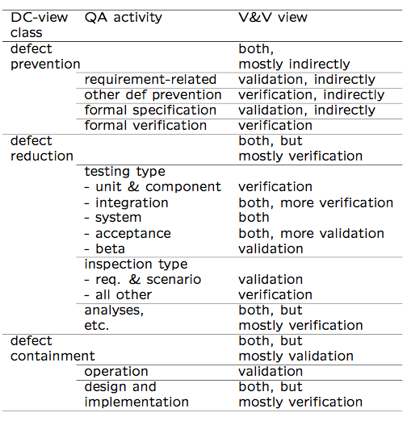

Software Quality Engineering
============================

	Testing, Quality Assurance, and Quantiable Improvement

Tian Siyuan <tiansiyuan@gmail.com>

# Chapter 4. QA in Context

-       Defect Handling

-       QA in Software Processes

-       V&V Perspective

-       QA: Defect View vs V&V View

# QA in Context

-       QA and the overall development context

	-  defect handling/resolution
	-  activities in process
	-  alternative perspectives:

verification/validation (V&V) view

-       Defect handling/resolution

	-      status and tracking
	-      causal (root-cause) analysis
	-      resolution: defect removal/etc.
	-      improvement: break causal chain

# Defect Measurement and Analysis

-       Defect measurement:

	-      parallel to defect handling
	-      where injected/found?
	-      type/severity/impact?
	-      more detailed classification possible?
	-      consistent interpretation
	-      timely defect reporting

-       Defect analyses/quality models

	-      as followup to defect handling.
	-      data and historical baselines
	-      goal: assessment/prediction/improvement
	-      causal/risk/reliability/etc. analyses

-       Details in Part IV.

# QA in Software Processes

-       Mega-process:

	initiation, development, maintenance, termination.

-       Development process components:

	requirement, specification, design, coding, testing, release.

-       Process variations:

	-	waterfall development process
	-	iterative development process
	-	spiral development process
	-	lightweight/agile development processes and XP (extreme programming)
	-	maintenance process too
	-	mixed/synthesized/customized processes

-       QA important in all processes

# QA in Waterfall Process

-       QA throughout process (Fig 4.1 p.45)

	-  defect prevention in early phases
	-  focused defect removal in testing phase
	-  defect containment in late phases
	-  phase transitions: inspection/review/etc.

# QA in Software Processes

-       Process variations (not waterfall) and QA:

	-	iterative: QA in iterations/increments
	-	spiral: QA and risk management
	-	XP: test-driven development
	-	mixed/synthesized: case specific
	-	more evenly distributed QA activities

-       QA in maintenance processes:

	-     	focus on defect handling;
	-	some defect containment activities for critical or highly-dependable systems;
	-	data for future QA activities

-       QA scattered throughout all processes

# V&V

-       Core QA activities grouped into V&V.

-       Validation: w.r.t. requirement (what?)

	-	appropriate/fit-for-use/\right thing"?
	-	scenario and usage inspection/testing;
	-	system/integration/acceptance testing;
	-	beta testing and operational support.

-       Verification: w.r.t. specification/design (how?)

	-	correct/\doing things right"?
	-	design as specification for components;
	-	structural and functional testing;
	-	inspections and formal verification.

# V&V in Software Process

-       V&V in V-model above (Fig 4.2 p.49):

	-   V-model as bent-over waterfall
	-   left-arm: implementation (& V&V)
	-   right-arm: testing (& V&V)
	-   user@top vs. developer@bottom

# V&V vs DC View

-       Two views of QA:

	-   V&V view
	-   DC (defect-centered) view in this book
	-   Interconnected: mapping possible?

-       Mapping between V&V and DC view:

	-	V&V after commitment
		(defect injected already)
		=> defect removal & containment focus

	-	Verification: more internal focus
	-	Validation: more external focus
	-	In V-model: closer to user (near top) or developer (near bottom)?

# DC-V&V Mapping (Table 4.1, p.51)

