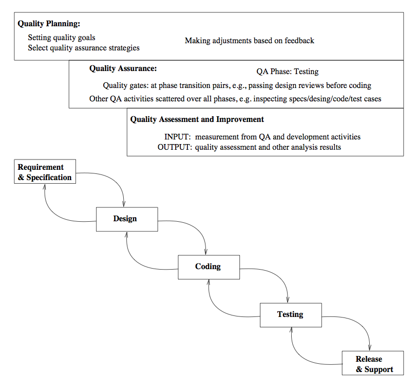
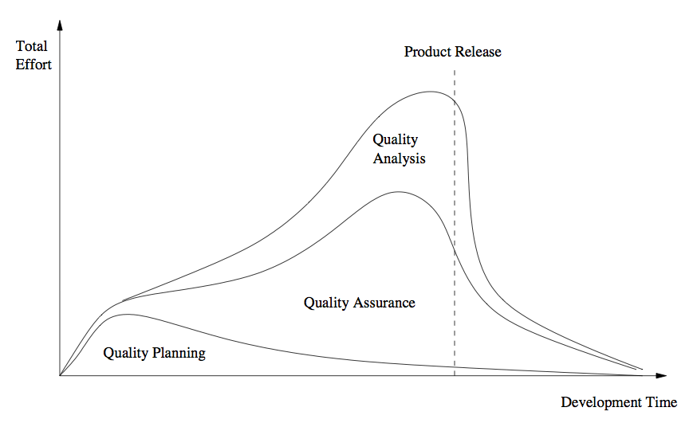

Software Quality Engineering
============================

	Testing, Quality Assurance, and Quantiable Improvement

Tian Siyuan <tiansiyuan@gmail.com>

# Chapter 5. Quality Engineering

-       SQE: Software Quality Engineering

-       Key SQE Activities

-       SQE in Software Process

# QA to SQE

-       QA activities need additional support:

	-  Planning and goal setting
	-  Management:

	   -	when to stop?
	   -	adjustment and improvement, etc.
	   -	all based on assessments/predictions

-       Assessment of quality/reliability/etc.:

	-  Data collection needed
	-  Analysis and modeling
	-  Providing feedback for management

-       QA + above

	=> software quality engineering (SQE)

# SQE Process

-       SQE process to link major SQE activities: Fig 5.1 (p.54)

	-   Pre-QA planning;
	-   QA: covered previously (Ch.3 & 4);
	-   Post-QA analysis and feedback
	    (maybe parallel instead of "post-")

# SQE and QIP

-       QIP (quality improvement paradigm):

	-   Step 1: understand baseline
	-   Step 2: change then assess impact
	-   Step 3: package for improvement

-       QIP support:

	-   overall support: experience factory
	-   measurement/analysis: GQM
	    (goal-question-metric paradigm)

-       SQE as expanding QA to include QIP ideas.

# Pre-QA Planning

-       Pre-QA planning:

	-      Quality goal
	-      Overall QA strategy:

	       -       QA activities to perform?
	       -       measurement/feedback planning

-       Setting quality goal(s):

	-	Identify quality views/attributes
	-	Select direct quality measurements
	-	Assess quality expectations vs. cost

# Setting Quality Goals

-       Identify quality views/attributes

	-	 customer/user expectations,
	-	 market condition,
	-	 product type, etc.

-       Select direct quality measurements

	-      direct: reliability
	-      defect-based measurement
	-      other measurements

-       Assess quality expectations vs. cost

	-      cost-of-quality/defect studies
	-      economic models: COCOMO etc

# Forming QA Strategy

-       QA activity planning

	-  evaluate individual QA alternatives

	   -	    strength/weakness/cost/applicability/etc.

	-  match against goals
	-  integration/cost considerations

-       Measurement/feedback planning:

	-  define measurements (defect & others)
	-  planning to collect data
	-  preliminary choices of models/analyses
	-  feedback & followup mechanisms, etc.

# Analysis and Feedback

-       Measurement:

	-	defect measurement as part of defect handling process

	-	other data and historical baselines

-       Analyses: quality/other models

	-	input: above data
	-	output/goal: feedback and followup
	-	focus on defect/risk/reliability analyses

-       Feedback and followup:

	-	 frequent feedback: assessments/predictions
	-	 possible improvement areas
	-	 project management and improvement

-       Details in Part IV.

# SQE in Software Processes

-       SQE activities (cid:26) development activities:

	-   quality planning (cid:26) product planning
	-   QA activities (cid:26) development activities
	-   analysis/feedback (cid:26) project management

-       Fitting SQE in software processes:

	-	different start/end time
	-	different sets of activities, sub-activities, and focuses

	-	in waterfall process: more staged

		(planning, execution, analysis/feedback)

	-	in other processes:

		more iterative or other variations

# SQE in Waterfall Process

-       Fig 5.2 (p.61) above

	-   activity start/finish line
	-   different focus and effort (later)

# SQE Effort Profile

-       QE activity/effort distribution/dynamics:

	-  different focus in different phases
	-  different levels (qualitatively)
	-  different build-up/wind-down patterns
	-  impact of product release deadline

		(deadline-driven activities)

-       planning: front heavy

-       QA: activity mix

		(early vs. late; peak variability? deadline?)

-       analysis/feedback: tail heavy

		(often deadline-driven or decision-driven)

# SQE Effort in Waterfall Process

-       Effort profile above (Fig 5.3, p.63)

	-      planning/QA/analysis of total effort
	-      general shape/pattern only

	       (actually data would not be as smooth)

	-      in other processes:

	       - similar but more evenly distributed
