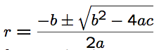
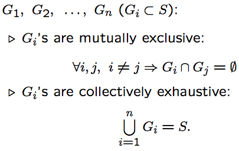
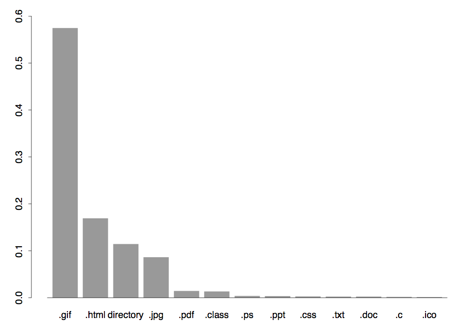

Software Quality Engineering
============================

	Testing, Quality Assurance, and Quantiable Improvement

Tian Siyuan <tiansiyuan@gmail.com>

# Chapter 8. Coverage and Usage Testing

Based on Checklists and Partitions

-	 Checklist-Based Testing

-	 Partitions and Partition Testing

-	 Usage-Based Testing with Musa’s OPs

-	 OP Development: Procedures/Examples

# Checklists for Testing

-	 Ad hoc testing:

	- "run-and-observe"
	- How to start the run?
	- Areas/focuses of "observations"?
	- Implicit checklists may be involved.

-	 Explicit checklists:

	- Function/features (external)
	- Implementation (internal)
	- Standards, etc.
	- Mixed or combined checklists

# Function Checklists

-	 Function/feature (external) checklists:

	- Black-box in nature
	- List of major functions expected

-	 Example: Table 8.1 (p.105)

	- abnormal termination
	- backup and restore
	- communication
	- co-existence
	- file I/O
	- gateway
	- index management
	- installation
	- logging and recovery
	- locking
	- migration
	- stress

# Implementation Checklists

-	 Implementation (internal) checklists:

	- White-box in nature
	- At different levels of abstraction

		- e.g., lists of modules/components/etc.
		- statement coverage as covering a list

-	 Related: cross-cutting features/structures:

	- Multiple elements involved.
	- Examples: call-pairs, diff. parts that cooperate/collaborate/communicate/etc.

-	 Other checklists:

	- related to certain properties

		- e.g., coding standards,

	- hierarchical list, e.g., refined Table 8.1

# Other Checklists

-	 Combined x-list based on n attributes for large products,

-	 Example: Table 8.2 (p.106)

-	 Checklists in other forms:

	- tree/graph/etc. => enumerate into lists
	- certain elements of complex models

		- e.g., lists of states and links in FSMs

# Checklists: Assessment

-	 Key advantage: simplicity.

-	 Possible drawbacks of checklists:

	- Coverage: need to fill "hole".
	- Duplication: need to improve efficiency.
	- Complex interactions not modeled.
	- Root cause: complexity

		- contributing to all 3 problems above.

-	 Possible solutions:

	- specialized checklists => partitions.
	- alternatives to checklists: FSMs.

# Checklists to Partitions

-	 Examples: solving ax^2 + bx + c = 0,

	- solution: 

	- input: a; b; c; output: r.
	- 32 bits floating point numbers used
	- input combinations:

		2^232 * 2^232 * 2^232 = 2^96

-	 3 solution partitions (Table 8.3, p.108):

# Partitions: Ideas and Definitions

-	 Partitions: a special type of checklists

	- Mutually exclusive => no overlaps.
	- Collectively exhaustive => coverage.
	- Address two problems of checklists.

		(Third addressed by FSMs in Chapter 10.)

-	 Partition of set S into subsets

-	 Each Gi forms an equivalent class (next).

# Partitions: Formal Definitions

-	 Relation: An association of interest to some observers among objects.

	- R(A1; A2; : : : ; An)
	- Binary relations: R(A; B) or ARB.

		most commonly used relations.

-	 Relational properties

	- Transitivity: ARB ^ BRC => ARC

		e.g., ">" relation.

	- Symmetry: ARB ^ BRA

		e.g., "is-neighbor-to" relation.

	- Reflexivity: ARA

		e.g., "=" relation.

-	 Equivalence relation:

	All the above properties hold.

# Partition-Based Testing (1)

-	 Different types of partition definitions:

	- membership based partition definitions
	- properties/relations used in definitions
	- combinations

-	 Basic idea of partition-based testing:

	- membership/equivalence-class analysis

		=> defining meaningful partitions

	- sampling from partitioned subsets for different types of partitions

-	 Extending basic coverage to perform non-uniform testing (later).

# Partition-Based Testing (2)

-	 Testing for membership in partitions:

	- partitions: components in a subsystems
	- testing via direct sampling,

		e.g., sampling 1 component/subsystem

-	 Testing for general partitions:

	- properties/relations used in definitions
	- direct predicates on logical variables

		- direct derivation of test cases

	- operations on numerical variables

		- sensitize (select) input values

-	 Testing for combinations of the above partition definitions

# Partition-Based Testing (3)

-	 Testing predicates on logical variables:

	- logical variable P as input

		- 2 partitions/test-cases: P=T, P=F.

	- P ^ Q, with 2 partitions (outcomes):
		- P ^ Q = T , with P = T and Q = T .
		- P ^ Q = F , 1 test case from 3 pairs:

			{(P=T, Q=F); (P=F, Q=T); (P=F, Q=F)}

-	 Testing comparisons on numerical variables:

	- x > 0, many possible test cases
		- x = 101: a specific test case

	- combinations: satisfy all conditions, e.g.,
		- (x > 0) ^ (y < 100), select x, y values individually, say x = 101 and y = 21;
		- (x > 0) ^ (x (cid:20) 100), select x value to satisfy both conditions, say x = 17.

# Partition-Based Testing (4)

-	 Testing multiple sets of partitions:

	- Divide-and-conquer.
	- Model as stages.
	- Combination (cross-product) of the stages.

		- e.g. binary partitions P followed by Q:
			four combinations: TT, TF, FT, FF.

-	 General: an m-way partition followed by an n-way partition: m * n combinations.

-	 Coordinated sensitization often needed, similar to for (x > 0) ^ (x <= 100) above.

# Partition-Based Testing (5)

-	 Extensions to basic ideas:

	- Sampling from partitioned subsets.
	- Coverage of partitions: non-uniform?
	- Testing based on related problems:

		- usage-related problems?
		- boundary problems?

	- Testing based on level/hierarchy/etc.?

-	 Usage-related problems:

	- More use => failures more likely
	- Usage information in testing

		=> (Musa’s) operational profiles (OPs)

-	 Boundary problems:

	Input domain boundary testing (Ch.9).

# Usage-Based Statistical Testing

-	 Usage based statistical testing (UBST) to ensure reliability.

-	 Reliability: Probability of failure-free operation for a specific time period or a given set of input under a specific environment

	- Reliability: customer view of quality
	- Probability: statistical modeling
	- Time/input/environment: OP

-	 OP: Operational Profile

	- Quantitative characterization of the way a (software) system will be used.
	- Generate/execute test cases for UBST
	- Realistic reliability assessment
	- Development decisions/priorities

# UBST: General Issues

-	 General steps:

	- Information collection.
	- OP construction.
	- UBST under OP.
	- Analysis (reliability!) and followup.

-	 Linkage to development process

	- Construction: Requirement/specification, and spill over to later phases.
	- Usage: Testing techniques and SRE

-	 Procedures for OP construction necessary

# UBST: Primary Benefit

-	 Primary benefit:

	- Overall reliability management.
	- Focus on high leverage parts

		=> productivity and schedule gains:
		
		- same effort on most-used parts
		- reduced effort on lesser-used parts
		- reduction of 56% system testing cost
		- or 11.5% overall cost (Musa, 1993)

-	 Gains vs. savings situations

	- Savings situation: AT&T (above)

		- reliability goal within reach
		- not to over test lesser-used parts

	- Gains situation: more typical

		- re-focusing testing effort
		- constrained reliability maximization

# UBST: Other Benefits

-	 Introducing new product

	- Highly-used features quickly
	- Lesser-used: subsequent releases

-	 Better communications/customer relations

	- Customer perspective & involvement

		=> closer ties to customers

	- More precise requirement/specification
	- Better training focus

-	 High return on investment:

	- OP cost, "average" 1 staff-month

		- 10 developers, 100KLOC, 18 months
		- sub-linear increase for larger ones

	- Cost-benefit ratio: 10

# OP: Concepts and an Example (1)

-	 Profile: Disjoint alternatives and their probabilities (sorted in decreasing order).

-	 Example: Table 8.4, p.112

	- file type usage OP for SMU/SEAS

# OP: Concepts and an Example (2)

-	 OP often as a graph, e.g., Fig 8.1 (p.113).
		- attractive alternative to table earlier.

# OP Characteristics and Usage

-	 Uneven distribution: basis for UBST to ensure product reliability (otherwise uniform sampling adequate)

-	 Usage of OPs in UBST:

	- Pure random sampling rare

		- requires dynamic (on-the-fly) decisions
		- might interfere with system functions

	- More often: pre-prepared test cases

		- "pseudo" randomness

	- Other variations:

		- normal cases and then perturbations
		- use of adjustable thresholds

	- \#operations^^ => cutoff threshold.

-	 OP sometimes directly used in reliability evaluations and improvement.

# Developing OP (1)

-	 OP: operations & their probabilities.

	- probability: partition that sum up to 1.

-	 Obtaining OP information:

	- identify distinct operations as disjoint alternatives.

	- assign associated probabilities

		- occurrences/weights => probabilities.
		
	- in two steps or via an iterative procedure

-	 OP information sources:

	- actual measurement.
	- customer surveys.
	- expert opinion.

# Developing OP (2)

-	 Actual measurement for OP construction:

	- Most accurate but also most costly.
	- Limitations for new products.
	- Legal/IP issues.

-	 Overcoming difficulties for new products:

	- Measurement for similar products.
	- Necessary adjustment.

-	 Overcoming legal/IP difficulties:

	- Similar to new product strategy above?
	- Voluntary participation:

		- "out" participation: beta testing,
		- "in" participation: ECI in IBM
		
	- Use of existing logs/records/etc.

# Developing OP (3)

-	 Customer surveys:

	- Less accurate/costly than measurement.
	- But without the related difficulties.
	- Key to statistical validity:

		- large enough participation
		- "right" individuals completing surveys

	- More important to cross-validate

		- see example study in Section 8.5.

-	 Expert opinion:

	- Least accurate and least costly.
	- Ready availability of internal experts.
	- Use as a rough starting point.

# Developing OP (4)

-	 Who should develop OP?

	- System engineers

		- requirement => specification

	- High-level designers

		- specification => product design

	- Planning and marketing
		- requirement gathering

	- Test planners (testing)

		- users of OP

	- Customers (implicitly assumed)

		- as the main information source

-	 Key: those who can help us

	- identify distinct alternatives (operations)
	- assign associated probabilities

# Developing OP (5)

-	 One OP or multiple OPs?

	- One OP for each homogeneous group of users or operations:
	
		- user group or market segmentation
		- groups of operations (op. modes)

	- Fundamental differences ) split
	- Hybrid strategy often useful:

		- develop separate OPs
		- merged OP for overall picture
		- both types offer valuable info.

-	 Development procedure (2 variations)

	- Top-down/Musa-1: (Musa, 1993)
	- Musa-2: Musa 1998 book (Chapter 3)

# OP Development: Musa-1

-	 One OP for each homogeneous group of users or operations.

-	 Top-down procedure focusing on external users and their product usage.

-	 Generic steps:

	1. Find the customer profile.
	2. Establish the user profile.
	3. Define the system modes.
	4. Determine the functional profile.
	5. Determine the operational profile.

-	First two steps external view;
	
	last three steps internal view.

# Musa-1.1: Finding the Customer Profile

-	 Differentiate customer from users

	- Customer: acquisition of software
	- User: using software

-	 Weight assignment:

	- By #customers
	- By importance/marketing concerns, etc.

-	 Example: Table 8.5 (p.118)

	

# Musa-1.2: Establishing the User Profile (1)

-	 Breakdown of customer groups

	- Different usages of user groups
	- Merging similar users across customers

-	 Weighting factor assignment for user weights within customer types:

	- by users (equal usage intensity)
	- by usage frequency
	- other factors also possible

-	 Comprehensive user profile derivation:

	weighted sum of individual user profiles

# Musa-1.2: Establishing the User Profile (2)

-	 Example: Table 8.6 (p.119)

	- row: user type
	- column: user profile in a customer type
	- customer profile used to calculate

	comprehensive user profile:
	0:8 * 0:5 (com) + 0:9 * 0:4 (gov) +
	0:9 * 0:05 (edu) + 0:7 * 0:05 (etc)
	= 0.84

# Musa-1.3: Defining System Modes

-	 System mode

	- A set of functions/operations
	- For operational behavior analysis
	- Practicality: expert for system mode

-	 Example modes

	- Business use mode
	- Personal use mode
	- Attendant mode
	- System administration mode
	- Maintenance mode
	- Probabilities (weighting factors)

# Musa-1.4: Determining Functional Profile

-	 Identifying functions

	- Function: high-level task/work of the projected system in the requirement.

	- Input domain partitions/combinations
	- Hardware/OS/system configuration
	- Base on environmental variables

-	 Creating/consolidating function list

	- From system requirement
	- From prototypes/previous release/user manual etc.

-	 Determining occurrence probabilities

	- Measurement and adjustment
	- Functions <=> operations

# Musa-1.5: Determining OP

-	 Refining functional profile into OP

-	 Defining operations

	- Operation: implemented task/work that can be used as part of system test plan

	- Defining the input space
	- Partitioning input space into operations
	- Typically: 1 function ) n operations

-	 Obtaining occurrence probabilities

	- In-field measurement
	- Estimation for new systems or added functionalities using symbolic models or prototypes

	- Help from functional probabilities

# OP Development: Musa-2 (1)

-	 One OP for each operational mode

	(testing under specific modes in practice)

-	 General idea:

	- Op. group: coarse -> fine -> individual.
	- Focus: internal users (testers).

-	 Generic steps:

	1. Identify initiators of operations.
	2. Tabular or graphical representation.
	3. Operations lists:

		initiators -> consolidated.

	4. Determine the occurrence rate.
	5. Determine the occurrence probability.

# OP Development: Musa-2 (2)

-	Identify initiators of operations

	- Who are the users of the system?

		human users, other hw/sw/network/etc.

	- Consolidate across organizations or customer types

-	Tabular vs graphical representation

	- Tabular: operation-probability pairs.
	- Graphical: stages/steps of operation

		- operation = a path in graph/tree
		- probability for branching

			(joint prob = product of indiv. prob.)

# OP Development: Musa-2 (3)

-	Operations lists:

	- Initiators => indiv. op. lists
	- Consolidation ) overall op. lists
	- Proper granularity adjustment:

		- possible split/merge

-	Determine the occurrence rate

	- Measurement (and survey?)
	- Tabulation

-	Determine the occurrence probability

	- Normalized occurrence rate
	- 0 <= pi <= 1 and Pi pi = 1

# OP Development: Musa-2 Example

-	 Example: Fig 8.2, p.121

	- a tree-structured OP
	- graphical (not tabular) representation
	- far right: equivalent flat OP

# Comparison: Musa-1 vs. Musa-2

-	 Generic steps:

	- Musa-1: customer -> user -> sys. modes -> functional -> operational

	- Musa-2: initiator -> representation -> list -> rate -> probability

-	 Comparison

	- Size/environment/population differences.
	- One OP for each distinguished group

		- Musa-1: user or operation group,
		- Musa-2: operational modes.

	- Musa-1: 5 profiles, refined along.
	- Musa-2: different elements for 1 profile.

# OP Construction: A Case Study

-	 Background:

	- Former CSE 5314 student
	- Course project: OP development
	- Application of Musa-1
	- Chruscielski/Tian: ISSRE’97 paper (IEEE-ISSRE’97 best paper award)

-	 Problem and key decisions:

	- Product: LMTAS/CSS
	- Product characteristics ) OP type
	
		- menu selection/classification type
		- flat instead of Markovian

	- Result OP, validation, and application

# OP Case Study (1)

-	 Participants:

	- Software Product Manager
	- Test Engineers
	- Systems Engineers
	- Customers
	- Chruscielski: pulling it together
	- Tian: technical advising
	- Chruscielski/Tian: documentation

-	 Information gathering

	- Interview Software Product Manager to identify target customers

	- Customer survey/questionnaire to obtain customer usage information

	- Preparation, OP construction and followup

# OP Case Study (2)

-	 Customer profile:

	- US Air Force and other AFs
	- Similar customers/usage ) one OP

-	 User profile: Table 8.7 (p.123)

# OP Case Study (3)

-	 User profile weighting:

	- User groups & marketing concerns.
	- Profile reflects both.
	- Idea applicable to other steps:

		- profile can be importance weighted

-	 System modes

	- No significant difference in op.
	- By-pass: proceed to functional profile

-	 Functional/operational profile:

	- CSS: functions ~= operations
	- Flat structure/choices => implicit profile

		(function-usage% vs. prob(op-sequence))

	- OPs: for both individual user groups and comprehensive

# OP Case Study (4)

-	 Analysis and followup

	- Cross-validation: Peer review by Software Product Manager, System Engineers and Test Engineers

	- Classification of usage frequencies found to be useful (table below)

	- Followup actions

-	 Table 8.8 (p.134) classified usage.

# Alternative Usage Models

-	 Motivation: enhance flat OP

	- Complicated operations involve many steps/stages in the end-to-end chain
	- Ability to use existing models and structural information
	- Ability to use localized knowledge
	- Local information easy to gather

-	 Markov OP: Basic ideas

	- Markov chain for usage information
	- State: operations/functions
	- Transition: probabilistic

		- reflects usage sequence/frequency
		- history independent (Markovian)
		- but reflects local usage info.

	- Details in Chapter 10.
