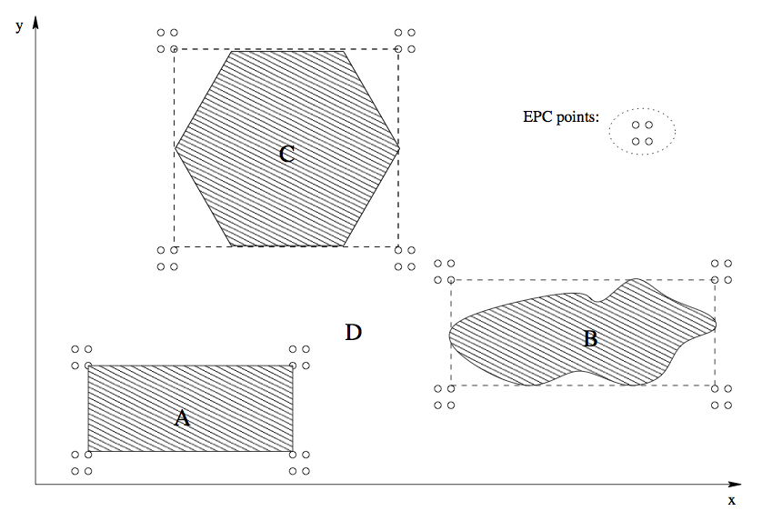
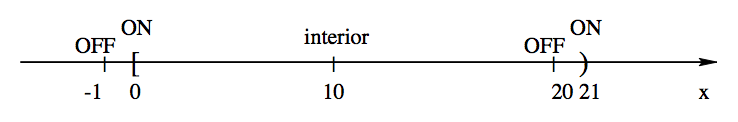
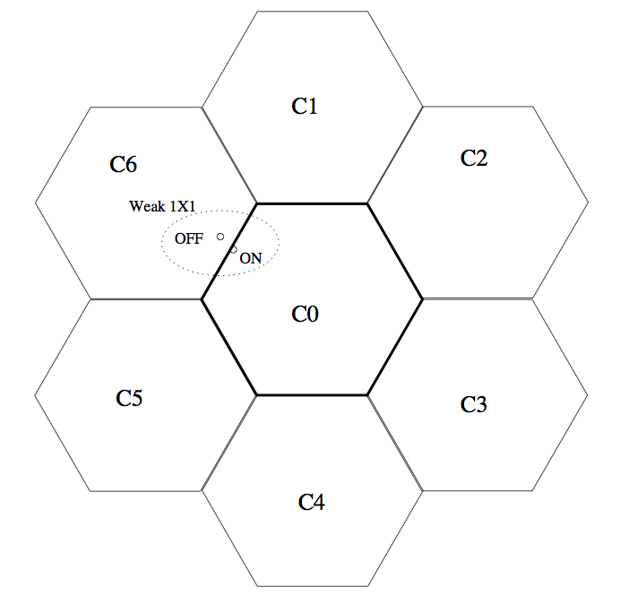

Software Quality Engineering
============================

	Testing, Quality Assurance, and Quantiable Improvement

Tian Siyuan <tiansiyuan@gmail.com>

# Chapter 9. Boundary Testing

-	 Input Domain Partitioning

-	 Simple Domain Analysis and Testing

-	 Important Boundary Testing Strategies

-	 Extensions and Perspectives

# Non-Uniform Partition Testing

-	 Extensions to basic partition testing ideas:

	Non-uniform partitioned testing.

	- Testing based on related problems
	- Usage-related problems => UBST
	- Boundary problems => What to do?

-	 Usage-related problems:

	- More use => more likely failures
	- Usage information in testing

		=> (Musa’s) operational profiles (OPs)

-	 Boundary problems (This Chapter):

	=> input domain boundary testing (BT).

# Boundary Testing: Overview

-	 What is it?

	- Test I/O relations.
	- Classifying/partitioning of input space:

		- case-like processing model.

	- Cover input space and related boundary conditions.

	- Also called (input) domain testing.

-	 Characteristics and applications?

	- Functional/black-box view

		(I/O mapping for multiple sub-domains)

	- Well-defined input data:

		- numerical processing and decisions.

	- Implementation information may be used.
	- Focus: boundaries and related problems.
	- Output used only in result checking.

# I/O Variables and Values

-	 Input:

	- Input variables: x1; x2; ... ; xn.
	- Input space: n-dimensional.
	- Input vector: X = [x1; x2; ... ; xn].
	- Test point: X with specific xi values.
	- Domains and sub-domains:

		specific types of processing are defined.

	- Focus on input domain partitions.

-	 Output (assumed, not the focus)

	- Output variables/vectors/space/range similarly defined.
	- Mapped from input by a function.
	- Output only used as oracle.

# Domain Partitioning and Sub-domains

-	 Input domain partitioning

	- Divide into sets of sub-domains.
	- "domain", "sub-domain", and "region" often used interchangeably

-	 A sub-domain is typically defined by a set of conditions in the form of:

		f (x1; x2; ... ; xn) < K

		where "<" can also be substituted by ">","=", "<>", "<=", or ">=".

# Domain Partitioning and Sub-domains

-	 Domain (sub-domain) boundaries:

	- Distinguishes/defines different sub-domains.
	- Each defined by it boundary condition,

		e.g., f (x1; x2; ...; xn) = K

	- Adjacent domains:

those share common boundary(ies)

-	 Boundary properties and related points:

	- Linear boundary:

		a1\*x1 + a2\*x2 + ... + an\*xn = K

		(Otherwise, it is a nonlinear boundary.)

	- Boundary point: on the boundary.
	- Vertex point: 2+ boundaries intersect.
	- Other properties w.r.t. domains later.

# Boundary and Domain Properties

-	 Boundary properties w.r.t domains:

	- Closed boundary: inclusive (<=, >=)
	- Open boundary: exclusive (<, >)

-	 Domain properties and related points:

	- Closed domain: all boundaries closed
	- Open domain: all boundaries open
	- Linear/nonlinear domain:

		all linear boundary conditions?

	- Interior point: in domain and not on boundary.

	- Exterior point: not in domain and not on boundary.

# Input Domain Partition Testing

-	 General steps:

	- Identify input variable/vector/domain.
	- Partition the input domain into sub-domains.
	- Perform domain/sub-domain analysis.
	- Define test points based on the analysis.
	- Perform test and followup activities.

-	 Boundary testing: Above with focus on boundaries.

-	 Domain analysis:

	- Domain limits in each dimension.
	- Domain boundaries (more meaningful).
	- Closure consistency?
	- Plotting for 1D/2D, algebraic for 3D+.

# Problems in Partitioning

-	 Domain partitioning problems:

	- Ambiguity: under-defined/incomplete.
	- Contradictions: over-defined/overlap.
	- Most likely to happen at boundaries.
	- Key: sub-domains form a partition.

-	 Related boundary problems:

	- Closure problem.
	- Boundary shift: f (x1; x2; : : : ; xn) = K + &
	- Boundary tilt: parameter change(s).
	- Missing boundary.
	- Extra boundary.

# Simple Domain Analysis and EPC

-	 Simple domain analysis:

	- identify domain limits in each dimension

		- min, max values

	- push "over" max, "under" min
		
		=> 4 values for each variable or dimension:

			under, min, max, over

-	 1D example: Fig 9.1 (p.133)

-	 Extreme point combinations (EPC)

	- Combine above to derive test points.
	- Combine variables ((cid:2), cross-product).
	- \# testcases: 4^n + 1.

# Simple Domain Analysis and EPC

-	 2D examples: 9.2 (p.134)

-	 Problems/shortcomings with EPC:

	- Missing boundary points: 2D example.

		(unless boundaries perfectly aligned)

	- Exponential # testcases: 4^n + 1.
		=> Need more effective strategies.

# Boundary Testing Ideas

-	 Using points to detect boundary problems:

	- A set of points selected on or near a boundary: ON and OFF points.
	- Able to detect movement, tilt, etc.
	- Motivational examples for boundary shift.

-	 E	neighborhood and ON/OFF points

	- Region of radius -	 around a point
	- Theoretical: could be infinitesimal
	- Practical: numerical precision
	- ON point: On the boundary
	- OFF point:

		- opposite to ON processing
		- off boundary, within -	 distance
		- closed boundary, outside
		- open boundary, inside

# Weak N x 1 Strategy

-	 N x 1 strategy (N-dimensional space)

	- N ON points (linearly independent):

		confirm (n-1)-D hyper-plane boundary.

	- 1 OFF point: centroid of ON points.
	- 1D: 1 ON, 1 OFF
	- 1D examples: Fig 9.3 (p.137)

-	 Typical errors detected:

	- Closure bug
	- Boundary shift
	- Boundary tilt (later)
	- Extra boundary (sometimes)
	- Missing boundary

# Weak N x 1 Strategy

-	 N x 1: N ON and 1 OFF points

	- Weak: set of tests per boundary instead of per boundary segment.

	- \#test points: (n + 1) (cid:2) b + 1
	- 2D example: Fig. 9.4 (p.137) below

		- advantages over EPC!

# Weak N x 1 Strategy

-	 Boundary tilt: Fig 9.5 (p.138) above

	- series of tilting points
	- some ON/OFF points combination will detect each tilt

	- (moving) illustration in class

-	 Other problems detected (cid:25) 1D example

# Weak 1 x 1

-	 Motivation: #test-points# without losing
much of the problem detection capability.

	- boundary defined by 1 ON 1 OFF

		(n ON points in weak N x 1 form an equivalent class => sampling 1)

	- 2D example: Fig 9.6 (p.139) below.

-	 Typical errors detected:

	- Closure bug
	- Boundary shift
	- Boundary tilt (not always!)
	- Missing boundary
	- Extra boundary (sometimes)

-	 Tilting in Fig 9.7, p.140, below

	(miss tilting at ON point, vs. Weak N(cid:2)1)

# Other BT Strategies

-	 Strong vs. weak testing strategies:

	- Weak: 1 set of tests for each boundary
	- Strong: 1 set of tests for each segment

-	 Why use strong BT strategies?

	- Gap in boundary condition
	- Closure change
	- Coincidental correctness:

		particularly stepwise implementation

	- Code clues: complex, convoluted
	- Use in safety-critical applications

-	 Nonlinear boundaries: Approximate (e.g., piecewise) strategies often useful.

# BT Extensions

-	 Direct extensions

	- Data structure boundaries.
	- Capacity testing.
	- Loop boundaries (Chapter 11).

-	 Other extensions

	- Vertex testing:

		- problem with boundary combinations
		- follow after boundary test (1 X 1 etc.)
		- test effective concerns

	- Output domain in special cases

		- similar to backward chaining
		- safety analysis, etc.

-	 Queuing testing example below.

# BT and Queuing

-	 Queuing description: priority, buffer, etc.

-	 Priority: time vs. other:

	- time: FIFO/FCFS, LIFO/stack, etc.
	- other/explicit: SJF, priority#, etc.
	- purely random: rare

-	 Buffer: bounded or unbounded?

-	 Other information:

	- Pre-emption allowed?
	- Mixture/combination of queues
	- Batch and synchronization

# Testing a Single Queue

-	 Test case design/selection:

	- Conformance to queuing priority.
	- Boundary test
	- Test cases: input + expected output.
	- Combined cases of the above.

-	 Testing specific boundary conditions:

	- lower bound: 0, 1, 2 (always)
	- server busy/idle at lower bound
	- upper bounds: B, B +/- (bounded Q)

		for bounded queue with bound B

-	 Other test cases:

	- Typical case: usage-based testing idea.
	- Q unbounded: some capacity testing.

# BT Limitations

-	 Simple processing/defect models:

	- Processing: case-like, general enough?
	- Specification: ambiguous/contradictory.
	- Boundary: likely defect.
	- Vertex: ad hoc logic.

-	 Limitations

	- Processing model: no loops.
	- Coincidental correctness: common.
	- e-limits, particularly problematic for multi-platform products.

	- OFF point selection for closed domain

		- possible undefined territory,
		- may cause crash or similar problems.

	- Detailed analysis required.
