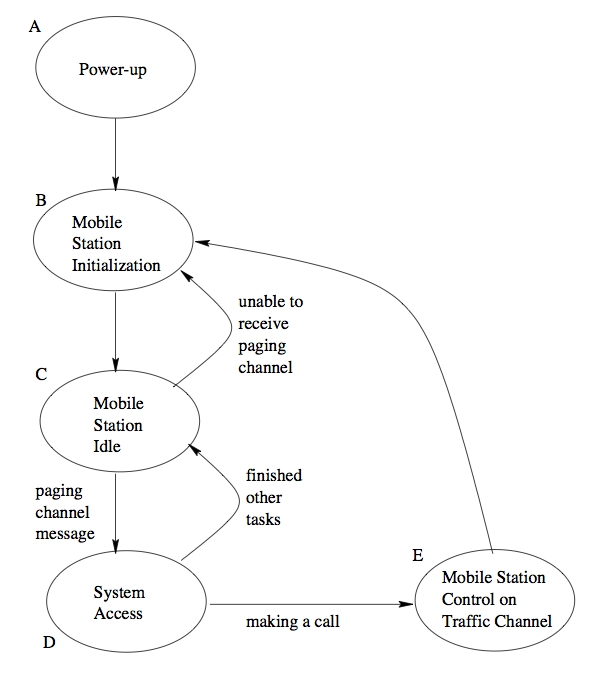
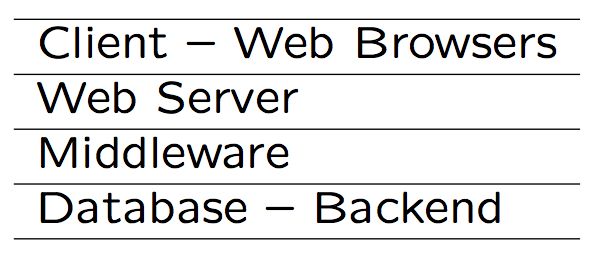
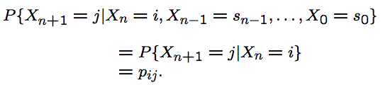
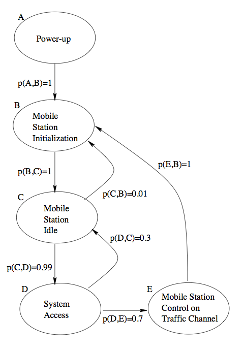
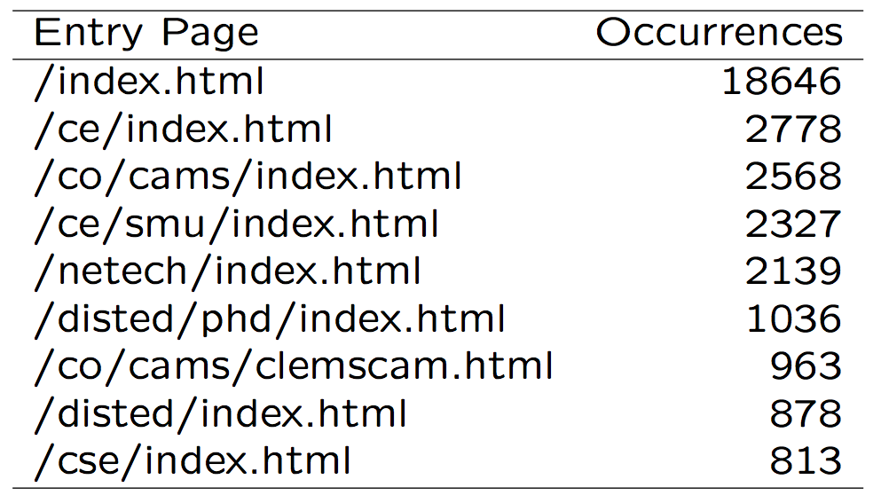

Software Quality Engineering
============================

	Testing, Quality Assurance, and Quantiable Improvement

Tian Siyuan <tiansiyuan@gmail.com>

# Chapter 10. Coverage and Usage Testing Based on FSMs and Markov Chains

-	 Finite-State Machines (FSMs)
-	 FSM-Based Testing
-	 Markov Chains as Enhanced FSMs
-	 Unified Markov Models for Testing

# Alternative Testing Models

-	 Motivation: Why FSMs?

	- Complicated operations involve many steps/stages in the end-to-end chain
	- Not modeled in checklists/partitions
	- Ability to use existing models and structural information
	- Ability to use localized knowledge
	- Local information easy to gather

-	 FSM: Basic ideas

	- State: operations/functions
	- Transition: link in a chain
	- Input/output associated with transition
	- Complete operation: chain

# FSMs as Graphs

-	 FSMs often represented by graphs.

-	 State/node and properties

	- Represents status/processing/component
	- Identification and labeling
	- Other properties: node weights

-	 Links and link properties

	- Represent state transitions
	- Labeling: Often by the nodes they link
	- Other properties: link weights
		- associated input and output

	- Directed (e.g., A-B link <> B-A link)

# Types of FSMs

-	 Types of FSMs:

	- Classification by input/output
	- Classification by state
	- Other classifications possible

-	 FSM types by input/output representation

	- Mealy model: both input and output associated with transitions
	- Moore model: output represented as separate states
	- Mealy model used in this book

# Types of FSMs

-	 Classification by state representation

	- Type I. state = status, with most of the processing and I/O at transition
	- Type II. transition = I/O free link, with most of the processing and I/O at state
	- We use both, and mixed type too

-	 Type I & II as Mealy models

	- Type I: classical Mealy model
	- Type II: modified Mealy model, I/O not explicitly represented in FSMs
	- Mixed type: used for convenience if not leading to confusion

# Types of FSMs

-	 Type I example: classical Mealy model

	- also web testing example in Section 10.3

-	 States:

	- "initial" state: when program starts
	- "final" state: where program terminates
	- other states (and transitions below)

-	 State transitions accompanied by some processing and associated I/O

	- performing user-oriented functions
	- execution some statements
	- I/O associated with above (or empty)

# Types of FSMs

-	 Type II example: control flow graph (CFG) or flow chart in Chapter 11

-	 Mixed type for convenience

	- Hard to restrict to one type

		=> use mixed type

	- Ensure no confusion
	- Key: significant difference among states so that state transitions are meaningful

# Types of FSMs

-	 Mixed type example: Fig 10.1 (p.151)

	- states with processing: A, B, D, E
	- state w/o processing: C (status)
	- transitions: implicit or no output

		- explicit input: C-D, C-B, D-C, D-E
		- implicit/no input: A-B, B-C, E-B

# FSM Representation

-	 FSM as a table/matrix

-	 Cell (x, y): I/O associated with transition from state x to state y
		- "na": transition not allowed

-	 Table 10.1 (p.152) for FSM in Fig 10.1

# FSM/Graph Representation

-	 Types of graphs

	- Directed graph: FSM etc
	- Undirected graph: neighbor-relation, etc
	- Connectivity vs. disconnected graphs

-	 Graph representation:

	- Graphical: good for human processing

	  (mostly in the book)

	- Tables/matrices: machine processing
	- Lists: compact sets of items like {C, B, "unable to receive paging channel", -}
	- Conversion: easy, but need to know how

# Basic FSM Testing

-	 Typical problems:

	- Missing, extra, or incorrect states
	- Missing, extra, or incorrect transitions
	- Input problems: treat as related state or transition problems
	- Output problems: as oracle problems.

-	 Basic approach:

	- Missing/extra states/transitions dealt with at FSM construction stage
	- Basic coverage: Node and link coverage via state traversal based on graph theory and algorithms
	- Assuming correct functioning of individual state ensured by lower level testing

# Basic FSM Testing

-	 Checking for missing/extra states/links during model construction

-	 Model construction steps

	- Identify info. sources and collect data
	- Construct initial FSM
	- Model refinement and validation

-	 Identify information sources and collect data

	- external functional behavior (black-box)

		- specification, usage scenarios, etc.

	- internal program execution (white-box)

		- design, code, execution trace, etc.

	- also existing test cases, documents, etc.
	- key: linking individual pieces together

# Basic FSM Testing

-	 Construct initial FSM.

	- state identification and enumeration

	  (states^^ => nested/hierarchical FSMs)

	- transition/link identification
	- identify I/O relations (as test oracles)
	- key sub-step: link identification

-	 Link identification and problem detection:

	- identify all possible input for each state
	- input values may be partitioned (Chapter 9)
	- each partitioned subset/subdomain associated with a state transition
	- undefined transition for some input
	  => missing state or extra link identified.
	- extra state or missing link identified by the collective states and transitions (or by connectivity algorithm later)

# Basic FSM Testing

-	 Model refinement and validation.

	- Refinement with additional states/links.
	- State explosion concerns

		- at most \dozens" of states in FSMs

	- Proper granularity needed

	  => use of nested/hierarchical FSMs

-	 Applicability

	- Suitable for menu driven software
	- Systems with clearly identified states/stages
	- Interactive mode (many I/O pairs)
	- Control systems, OOS, etc.

-	 Key limitation: state explosion!

	 => nested FSMs, or Markov chains (later)

# Basic FSM Testing

-	 Node/link coverage via state traversal

	- Based on graph theory/algorithms
	- States directly covered
	- Link coverage: starting from state in combination with input domain testing ideas (Chapter 8 & 9).

-	 Implementation issues:

	- Sensitization: easy, with specific input
	- State cover: series of links with input
	- Capability to \save" state information

		- help with link coverage from the state
		- state traversal w/o much repeating

	- Oracle: output with link

	  (and destination state too!)

# Case Study: FSMs for Web Testing

-	 Web applications vs. menu-driven systems

	- Many similarity but significant differences
	- Computation vs. information/document
	- Separate vs. merged navigations
	- Entry/exit/control difference
	- Differences in population size/diversity
	- Layers in web applications

-	 Web layers: Fig. 10.2 (p.158)

# Case Study: FSMs for Web Testing

-	 Web problems: What to test

	- Reliability: failure-free content delivery
	- Failure sources identified accordingly

		- host or network failures
		- browser failures
		- source or content failures
		- user problems

	- Focus on source/content failures

-	 Web source/content components

	- HTML and other documents
	- Programs (Java/JavaScript/ActiveX/etc.)
	- Data forms and backend databases
	- Multi-media components

# FSMs for Web Testing

-	 Testing of individual components

	 ~ traditional testing (mostly coverage)

-	 Testing of overall operation

	- FSMs for navigation/usage
	- States = pages
	- Transitions = embedded links

	  (direct URLs not by content providers)

	- I/O: clicks & info. loading/displaying

-	 Difficulty: size!

	 => extending FSMs for selective testing

# Markov Usage Model: Overview

-	 Markov-chain OP models

	- State transitions and probability
	- Markov property
	- Attractive in interactive systems, GUI, and many state-transition types
	- Structural and conceptual integrity

-	 Comparison with Musa OP

	- Similar to FSM vs list/partitions
	- Musa OP as collapsed Markov chains
	- Coverage: harder to achieve

# Markov Usage Model

-	 Applications

	- Similar to flat OP (Musa), but captures more detailed information
	- Models functional structure and usage
	- Test case generation more complex
	- Result: both analytical and observational

-	 Background and Linkage

	- Augmented FSMs
	- Cleanroom background: testing technique and tools

	- (Whittaker and Thomason, 1994)

		- TSE 20(10):812-824 (10/94)

	- UMM and web testing at SMU

# Markov OP

-	 Example Markov chains: Fig 10.3 (p.162)

-	 FSMs with probabilistic state transition pij, probability from state i to state j

	 0 <= pij <= 1, and SUM(pij) = 1

# Markov OP and UMMs

-	 Memoryless or Markovian property

-	 Markov chain: pij history independent

	- most well-studied stochastic process
	- rich analytical/theoretical results
	- many applications

-	 UMM: Unified Markov Models

	- Hierarchical modeling idea.
	- Markov chains at different-levels.
	- More flexibility for statistical testing.

# UMM Example

-	 Example UMM

	- Fig 10.3 (p.162): top-level Markov OP
	- expand state E into Fig 10.4 (p.163) above

# Markov/UMM Construction: Steps

-	 Structure of Markov chain

	- State machines

	  e.g., IS-95 call processing ) Fig 10.3

	- Flow diagram/function description.
	- At proper granularity
	- Same as FSM construction earlier

-	 Transition probabilities:

	- Various way to obtain

		- measurement/survey/expert-opinion
		- Musa procedures (Chapter 8) usable?

	- May use structural/domain knowledge

-	 UMM hierarchy determination/adjustment along the way

# Markov/UMM Construction

-	 Other sources of information

	- Sources for FSMs, with emphasis on external/black-box information
	- Existing flow charts/testing model
	- Performance models
	  (especially for real time systems)
	- Analytical (e.g. queuing) models
	- Market/requirement analyses
	- Similar/earlier products
	- Industry standards/external surveys

-	 Use of the above information sources

	- for FSMs and transition probabilities
	- existing hierarchies ) UMM hierarchies?

# Markov/UMM Analysis

-	 Analysis of the chain/model

	- Static/stationary properties
	- Transient properties
	- Analysis difficulties if size increases or non-stationary process
	- Alternative: simulation & measurement

-	 Testing result analysis

	- Testing using Markov OP
	- Collect failure data
	- Fit to reliability models

	  => direct reliability assessment

# Markov/UMM: Testcase Generation

-	 Basic approaches

	- Markov chain => test cases
	- Static: off-line, traditional

		- need more analysis support

	- Dynamic: on-line, dynamic decisions

		- need more run-time support

-	 Whittaker/Thomason

	- Basic testing chain from Markov chain
	- Incorporating failure data
	- Results and result analysis

		- testing vs. usage comparison
		- mean-steps-between-failures

# Markov/UMM: Testcase Generation

-	 Avritzer/Weyuker (TSE 21, 9/95)

	- Both coverage &usage
	- Off-line test case generation
	- Path probability and coverage

		- overall testing, similar to Musa OP

	- Node probability and coverage

		- critical component testing

	- Call-pair probability and coverage

		- transition/interface testing

-	 Hierarchical testing with UMMs

	- High level coverage
	- Low level selective/statistical testing
	- Dynamic expansion

# UMM in Web Testing

-	 Web testing factors

	- Existing: coverage-based testing
	- Web size, complexity, user focus
	- Dynamic nature
	- Focus on source failures
	- Statistical web testing

		- modeling, testing, result analysis

-	 Measurement and analysis support

	- Model construction: access-log
	- Analysis: error-/access-logs
	- Some existing analyzers

# Statistical Web Testing

-	 High level testing: UMMs

	- Overall structure and linkage
	- Usage and criticality information
	- Guide/drive low level testing
	- Performance and reliability analyses

-	 Low level testing

	- HTML checkers
	- Other existing tools
	- Future: formal specification checker

# UMMs: Web Usage Modeling

-	 Example access log: Fig 10.5 (p.168)
-	 Web usage modeling based on information extracted from web access logs

# UMMs: Web Usage Modeling

-	 Access log analysis

	- Access frequency from different users
	- Timing analysis of accesses
	- Network traffic and performance

-	 For usage-based web testing?

	- usage patterns and frequencies
	- usage model: UMMs
	- using existing tool, e.g., FastStats, for summary statistics etc
	- new utility programs for other purposes
	- missing information: need extra effort and ways to collect additional data

# UMMs: Web Usage Modeling

-	 Entry pages: Table 10.2 (p.170)

-	 Skewed distribution => single top model

-	 Exit pages: implicit

# UMMs: Web Usage Modeling

-	 Top level model: Fig 10.6 (p.170)

	- Node and link information

		\#s not probabilities due to omission

	- Selection of top-hit pages
	- Grouping of low-hit pages
	- Lower level models connected to this

# UMMs vs. Musa

-	 Flat (Musa) vs. Markovian OPs

	- Granularity and sequencing differences
	- Use in test case generation

		- Musa: direct test cases
		- Markov: tool to generate test cases

	- Use in reliability analysis

		- overall (both) vs. localized (Markov)

-	 Common issues

	- Musa’s 5 steps applicable to both
	- Focus on customer and reliability
	- Information collection

-	 Integrating Markov and Musa OPs

	 (and traditional testing): Chapter 12

# Choice: Musa vs Markov/UMM

-	 External (primary) factors to consider

	- Product size
	- Product/usage structure
	- Link/sequence of operations
	- Granularity of info. available

-	 Internal (secondary) factors to consider

	- Ability to handle complexity
	- Desired level of detail
	- Tool support

-	 Key: What does the user see?

	 (unit of operation or in a lump?)

# Conversion: Musa <> Markov

-	 Is conversion meaningful?

-	 Musa to Markovian

	- enough info?
	- additional information gathering
	- additional analysis/construction

-	 Markovian to Musa

	- prob(path) from prob(links)
	- loops => prob. threshold
	- mostly related to test case generation

# Summary and Comparison

-	 FSMs and Markov-OPs/UMMs

	- More complex operations/interactions
	- More complex models too!
	- Need algorithm and tool support for analysis and testing
	- Difficulties with FSMs: state explosion

		=> UBST with Markov-OPs/UMMs

-	 FSM testing focus on traversal of individual states and links => extend FSMs to test problems involving more states/links

	- specialized FSM to test execution paths
	- test related data dependencies?
	- CFT and DFT techniques (Chapeter 11)
