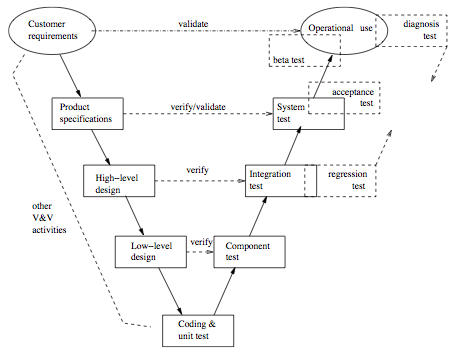
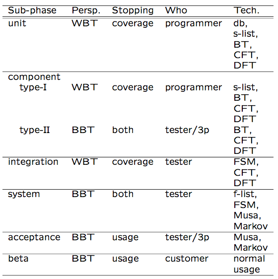
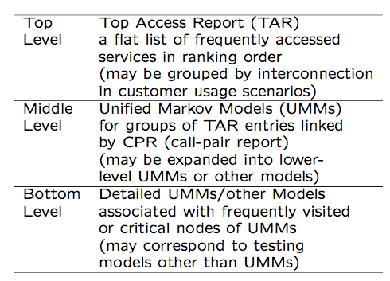

Software Quality Engineering
============================

	Testing, Quality Assurance, and Quantiable Improvement

Tian Siyuan <tiansiyuan@gmail.com>

# Chapter 12. Testing Techniques: Adaptation, Specialization, and Integration

-       Adaptation to Test Sub-phases

-       Specialized Testing Techniques

-       Integration and Web Testing Case Study

# Applications of Testing Techniques

-       Major testing techniques covered so far:

        -       Ad hoc (non-systematic) testing.
        -       Checklist-based testing.
        -       Partition-based coverage testing.
        -       Musa’s OP for UBST.
        -       Boundary testing (BT).
        -       FSM-based coverage testing.
        -       Markov chains and UMMs for UBST.
        -       Control (cid:13)ow testing (CFT).
        -       Data (cid:13)ow testing (DFT).

-       Application and adaptation issues:

        -       For di(cid:11)erent purposes/goals.
        -       In di(cid:11)erent environments/sub-phases.
        -       Existing techniques: select/adapt.
        -       May need new or specialized techniques.

# Testing Sub-Phases

-       Annotated V-model for testing sub-phases:

	Fig 12.1 (p.204)

        -       solid box: original sub-phase
        -       dashed box: added sub-phase or specialized testing

# Testing Sub-Phases

-       Original sub-phases in V-model:

        -       Operational use (not testing, strictly).
        -       System test for product speci(cid:12)cation.
        -       Integration test for high-level design.
        -       Component test for low-level design.
        -       Unit test for program code.

-       Additional sub-phases/specialized testing:

        -       Diagnosis test through all sub-phases.
        -       Beta test for limited product release.
        -       Acceptance test for product release.
        -       Regression test for legacy products.

# Unit Testing

-       Key characteristics:

        -       Object: unit (implemented code)

		-	function/procedure/subroutine in C, FORTRAN, etc.

		-	method in OO languages

        -       Implementation detail => WBT.

		(BBT could be used, but less often.)

        -       Exit: coverage (reliability undefined).

-       Commonly used testing techniques:

        -       Ad hoc testing.
        -       Informal debugging.
        -       Input domain partition testing and BT.
        -       CFT and DFT.

# Component Testing

-       Key characteristics:

        -       Object: component ((cid:27) unit), 2 types.
        -       I. collection of units in C/FORTRAN/etc.

		-  implementation detail ) WBT.

        -       II. class in OO languages

		-   reusable component ) BBT.

        -       Exit: coverage (sometimes reliability).

-       Commonly used testing techniques:

        -       for traditional systems (component I)

	~ unit testing, but at larger scale

        -       for OOS/COTS/CBSE (component II)

		~ system testing, but at smaller scale
                -       see system testing techniques later

# Integration Testing

-       Key characteristics:

        -       Object: interface and interaction among multiple components or subsystems.
        -       Component as a black-box (assumed).
        -       System as a white-box (focus).
        -       Exit: coverage (sometimes reliability).

-       Commonly used testing techniques:

        -       FSM-based coverage testing.
        -       Other techniques may also be used.
        -       Sometimes treated as (cid:26) system testing
		=> see system testing techniques below.

# System Testing

-       Key characteristics:

        -       Object: whole system and the overall operations, typically from a customer’s perspective.
        -       No implementation detail => BBT.
        -       Customer perspective => UBST.
        -       Exit: reliability (sometimes coverage).

-       Commonly used testing techniques:

        -       UBST with Musa or Markov OPs.
        -       High-level functional checklists.
        -       High-level FSM, possibly CFT & DFT.
        -       Special case: as part of a "super"-system in embedded environment
		=> test interaction with environment.

# Acceptance Testing

-       Key characteristics:

        -       Object: whole system.

                -       but defect fixing no longer allowed.

        -       Customer acceptance in the market.
        -       Exit: reliability.

-       Commonly used testing techniques:

        -       Repeated random sampling without defect fixing.
		(~ assumption for IDRMs, Chapter 22.)
        -       UBST with Musa or Markov OPs.
        -       External testing services/organizations may be used for system "certification".

# Beta Testing

-       Key characteristics:

        -       Object: whole system
        -       Normal usage by customers.
        -       Exit: reliability.

-       Commonly used testing techniques:

        -       Normal usage.
        -       Ad hoc testing by customers.

		(trying out di(cid:11)erent functions/features)

        -       Diagnosis testing by testers/developers to fix problems observed by customers.

# Testing Sub-Phases: Comparison

-       Key characteristics for comparison:

        -       Object and perspectives.
        -       Exit criteria.
        -       Who is performing the test.
        -       Major types of specific techniques.

-       "Who" question not covered earlier:

        -       Dual role of programmers as testers in unit testing and component testing I.
        -       Customers as testers in beta testing.
        -       Professional testers in other sub-phases.
        -       Possible 3rd party (IV&V) to test reusable components & system acceptance.

# Testing Sub-Phases: Summary

-       Summary: Table 12.1 (p.209)

# Specialized Testing

-       Specialized testing tasks:

        -       Some do not fit into specific sub-phases.
        -       Di(cid:11)erent goals (other than reliability).
        -       Non-standard application environment.

-       Our coverage:

        -       Defect diagnosis testing.
        -       Defect-based testing.
        -       Regression testing.
        -       Testing beyond programs.
        -       Testing for other goals/objectives.

# Defect Diagnosis Testing

-       Context of defect diagnosis testing:

        -       In followup to discovered problems by customers or during testing.
        -       Pre-test: understand/recreate problems.
        -       Test result: faults located.
        -       Followup with fault removal and re-run/re-test to confirm defect fixing.

-       Defect diagnosis testing:

        -       Typically involve multiple related runs.
        -       Problem recreation as the starting point.
        -       Perturbation and observation.
        -       Domain knowledge important.
        -       More recorded defect information

		=> less reliance on defect diagnosis.

        -       Defect-based techniques (below) useful.

# Defect-Based Testing

-       General idea and generic techniques:

        -       Focus: discovered or potential defects

		(and related areas).

        -       Ad hoc testing based on defect guesses.
        -       Risk identification ) risk-based testing.

		(Part IV, esp. Chapter 21)

        -       Defect injection and mutation testing.

-       Defect injection and testing:

        -       Inject known defect (seed known fault).
        -       Test for both seeded and ingenuous faults.
        -       Missed faults ) testing technique".
        -       Also used in reliability modeling.

-       Mutation testing ~ defect injection testing, but systematic mutants used.

# Regression Testing

-       Context of regression testing:

        -       In software maintenance and support:

                -       ensure change 6) negative impact.

        -       In legacy software systems:

                -       ensure quality of remaining functions,
                -       during development/product update,
                -       new part ~ new development,
                -       focus: integration sub-phase & after.
        -       Re-test to verify defect fixing as well as no unintended consequences.

-       Regression testing techniques:

        -       Specialized analysis of change: ^-analysis.
        -       Focused testing on (new) ^-part.
        -       Integration of old and new.

# Other Specialized Testing

-       Testing beyond programs:

        -       Embedded and heterogeneous systems:

                -       test interactions with surroundings.

        -       Web testing, in case study later.

-       Testing to achieve other goals:

        -       Performance testing;
        -       Stress testing;
        -       Usability testing, etc.

-       Dynamic analysis and related techniques:

        -       Simulation to reduce overall cost.
        -       Prototyping, particularly in early phases.
        -       Timing and sequencing analysis.
        -       Event-tree analysis (ETA), Chapter 16.

# Test Integration

-       General idea:

        -       Many activities and tasks.
        -       Di(cid:11)erent techniques.
        -       Individual advantages and limitations.
        -       Much commonality exists.
        -       Possibility of integration?

-       Test integration: Advantages

        -       combined strength ) benefit".
        -       common elements ) cost#.
        -       (cid:13)exibility".

# Hierarchical Web Testing

-       Case study from Chapter 10 continued:

        -       Web navigation modeled by FSMs.
        -       UBST using UMMs to overcome state explosion problem of FSMs.
        -       Guiding existing web testing.

		(they typically focus on a small unit/facet)

        -       Lack of structure for overall hits

		=> use of simplified OPs (Musa OPs)

-       Overall approach:

        -       Top-tier: (cid:13)at (Musa) OP.
        -       Middle-tier: UMMs.
        -       Bottom-tier: existing web testing.

# Existing Web Testing

-       Web functionality testing:

        -       Focus on the web components identified in Chapter 10.
        -       HTML syntax checking via various tools.
        -       Link checking.
        -       Form testing.
        -       Verification of end-to-end transactions.
        -       Java and other program testing.

-       Beyond web functionality testing:

        -       Load testing.
        -       Usability testing.
        -       Browse rendering.

# Web Testing (from Ch.10)

-       Testing web navigations:

        -       FSM-based testing in Chapter 10.
        -       Web crawling via robots.

-       UMMs for web testing (Chapter 10).

        -       Availability/usage of web logs.
        -       Some observations:

                -       skewed top hit pages and x-references
                -       the impact of structural hierarchy

# Hierarchical Web Testing

-       Overall approach:

        -       Top-tier: (cid:13)at (Musa) OP

                -       for simplicity and skewed distribution.

        -       Middle-tier: UMMs

                -       importance of highly used navigations.

        -       Bottom-tier: existing web testing

                -       no need to re-invent wheels

-       Implementation support:

        -       TAR (top access report) ) top-tier
        -       CPR (call-pair report) to form clusters

		=> middle tier UMMs

        -       UMM refinement => bottom-tier

                -       low-level Markov chains and
                -       traditional (WBT-)testing models

# Hierarchical Web Testing

-       Implementation of the hierarchical web testing strategy: Fig 12.2 (p.218)

