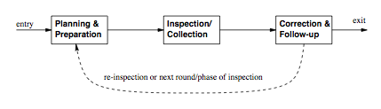
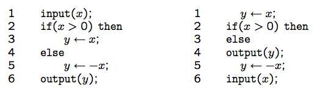

"Software Quality Engineering
============================

	Testing, Quality Assurance, and Quantiable Improvement

Tian Siyuan <tiansiyuan@gmail.com>

# Chapter 14. Inspection

-	Basic Concept and Generic Process
-	Fagan Inspection
-	Other Inspection and Related Activities
-	Other Issues

# QA Alternatives

-	Defect and QA

	-	Defect: error/fault/failure
	-	Defect prevention/removal/containment
	-	Map to major QA activities

-	Defect prevention

	Error blocking and error source removal

-	Defect removal

	-	Inspection - this chapter
	-	Testing, etc

-	Defect containment: Fault tolerance and failure containment (safety assurance)

# Inspection as Part of QA

-	Throughout the software process

	-	Coding phase: code inspection
	-	Design phase: design inspection
	-	Inspection in other phases and at transitions from one phase to another

-	Many different software artifacts

	-	program code, typically
	-	requirement/design/other documents
	-	charts/models/diagrams/tables/etc

-	Other characteristics

	-	People focus
	-	Not waiting for implemented system
	-	Complementary to other QA activities

# Generic Inspection Process

-	Generic process/steps: Fig 14.1 (p.238)

	1. Planning and preparation (individual)

	2. Collection (group/meeting)

	3. Repair (followup)

# Inspection Process Variations

-	Overall planning

	-	who? team organization/size/roles/etc
	-	what? inspection objects
	-	objectives?
	-	number/coordination of multiple sessions?

-	Technique

	-	for preparation (individual inspection)
	-	for collection

-	What to do with defects?

	-	always: detect and confirm defects
	-	classify/analyze defects for feedback?

-	Use of post-collection feedback?

# Fagan Inspection

-	General description

	-	Earliest, Fagan at IBM
	-	Lead to other variations
	-	Generic process and steps

-	Six steps of Fagan inspection

	1. Planning
	2. Overview (1-to-n meeting)
	3. Preparation (individual inspection)
	4. Inspection (n-to-n meeting)
	5. Rework
	6. Follow-up

-	Mapping to generic inspection process in Fig 14.1 (p.238)

# Fagan Inspection

1. Planning

	-	Entry criteria: what to inspect
	-	Team size: about 4 persons
	-	Developers/testers from similar projects
	-	Effectiveness concerns (assumptions)
	-	Inspectors not authors

2. Overview

	-	Author-inspectors meeting
	-	General background information

		- functional/structural/info., intentions

	-	Assign individual tasks

		- coverage of important areas
		- moderate overlap

3. Preparation or individual inspection

	-	Independent analysis/examination
	-	Code as well as other document
	-	Individual results

		- questions/guesses
		- potential defects

4. Inspection (generic: collection)

	-	Meeting to collect/consolidate

		individual inspection results

	-	Team leader/meeting moderator (1)
	-	Reader/presenter: summarize/paraphrase for individual pieces (assignment)
	-	Defect identification, but not solutions, to ensure inspection effectiveness
	-	No more than 2 hours
	-	Inspection report

5. Rework

	-	Author’s response
	-	Defect fixing (solutions)

6. Follow-up

	-	Resolution verification by moderator
	-	Re-inspection?

-	Fagan inspection in practice

	-	Widely used in industry
	-	Evaluation studies
	-	Variations and other inspections

# Fagan Inspection: Findings

-	Importance of preparation

	-	Most defect detected
	-	Meetings to consolidate defects
	-	=> alternatives focusing on preparation

-	Other important findings

	-	Important role of the moderator
	-	Team size and #sessions tailored to env
	-	Prefer systematic detection techniques to ad-hoc ones
	-	More use of inspection feedback/analysis

# Other Inspection Methods

-	Variations to Fagan inspection size/scope and formality variations

-	Alternative inspection techniques/processes

	-	Two-person inspection
	-	Meetingless inspections
	-	Gilb inspection
	-	Phased inspections
	-	N-fold inspections
	-	Informal check/review/walkthrough
	-	Active design reviews
	-	Inspection for program correctness
	-	Code reading
	-	Code reading with stepwise abstraction

# Reduced Size/Scope Inspection

-	Two-person inspection

	-	Fagan inspection simplified
	-	Author-inspector pair

		- reciprocal: mutually beneficial

	-	Smaller scale program

-	Meetingless inspections

	-	Importance of preparation (individual inspection) (most defects found during preparation)
	-	Empirical evidence
	-	1-on-1 instead of team meetings (or other feedback mechanisms)

# Gilb Inspection (Expanded Fagan)

-	Key: A"process brainstorming" meeting

	-	root cause analysis
	-	right after inspection meeting
	-	parallel to edit (rework)
	-	aim at preventive actions/improvement

-	Other characteristics

	-	Clearly identified input, checklists/rules extensively used
	-	Output include change request and suggested process improvement, in addition to inspected documents
	-	Team size: 4-6 people
	-	More emphasis on feedback loop more closely resemble our SQE process (Fig 5.1, p.54)

# Other Expanded Fagan Inspections

-	Phased inspections

	-	Expand Fagan inspection
	-	Multiple phases/meetings
	-	Each on a specific area/problem-type
	-	Dynamic team make-up

-	N-fold inspections

	-	Idea similar to NVP
	-	N parallel inspections, 1 moderator
	-	Duplications => cost increase
	-	Discussed in connection to NVP (Chapter 16)

# Informal Inspection

-	Desk check (self conducted)

	-	Should focus on conceptual problems
	-	Use tools for problems with syntax/spelling/format/etc

-	Informal review (by others)

	-	Similar to desk check, but by others
	-	Benefit from independent/orthogonal views
	-	Group reviews for phase transitions

-	Walkthroughs

	-	More organized, but still informal
	-	Leading role of author/moderator
	-	Less preparation by other participants than in inspection

# Formal Inspection: Code Reading

-	Program comprehension: Fig 14.2 (p.245)

	-	a program (left) and its permutation (right)
	-	different effort in comprehension
	-	different recall accuracy
	-	experience factor (expert vs novice)

-	Related to top-down design and code reading/abstraction (bottom-up)

# Formal Inspection: Code Reading

-	Code reading

	-	focus on code
	-	optional meetings

-	Code reading by stepwise abstraction

	-	basis: program comprehension studies
	-	variation to code reading

		- formalized code reading technique

	-	top-down decomposition and bottom-up abstraction
	-	recent evidence of effectiveness

# Formal Inspection: ADR & Correctness

-	Active design reviews (ADR)

	-	Another formal inspection, for designs
	-	Inspector active vs. passive
	-	Author prepares questionnaires
	-	More than one meeting
	-	Scenario based (questionnaires)
	-	Overall ADR divided into small ones
	-	2-4 persons (for each smaller ADR)

-	Inspection for program correctness

	-	Correctness (vs. questionnaire) of

		- topology (decomposition, hierarchy)
		- algebra (equivalence of refinements)
		- invariance (variable relations)
		- robustness (error handling)

	-	Close to formal verification

# Extending Inspection: Analysis

-	Inspection as analysis

	-	Program/document/etc. analysis
	-	Inspection as statics analysis
	-	Testing as dynamic analysis

-	Other analyses

	-	Static: algorithm, decision table, boundary value, control flow, data flow, etc
	-	Dynamic: symbolic execution, simulation, prototyping, timing, in-field execution, etc
	-	Covered in SQE (various chapters), with pointers in Section 14.3.5
	-	Detailed reference: Wallace et al 1996

		(NIST Special Publication 500-234) available online

# Defect Detection Techniques

-	Ad-hoc vs. systematic ones below checklist-/scenario-/abstraction-based

-	Checklist-based inspection

	-	Similar to testing checklists (Chapter 8)
	-	Basic types: artifact-/property-based

-	Scenario-based inspection

	-	Similar to usage-based testing
	-	Scenarios ties multiple components
	-	More a usage/external view
	-	Suitable for OOS

-	Abstraction-based inspection: Similar to code reading with stepwise abstraction

# Implementation and Effectiveness

-	Implementation support

	-	Process and communication support
	-	Repository management tools
	-	Defect tracking and analysis as followup
	-	Still human intensive

-	Effectiveness studies

	-	Measurement: defect or effort
	-	Defect detection technique important
	-	Inspector skills/expertise also important
	-	Other factors, less than unanimous
	-	Many individual variations

# Summary

-	Key advantages

	-	Wide applicability and early availability
	-	Complementary to testing/other QA
	-	Many techniques/process to follow/adapt
	-	Effective under many circumstances

-	Key limitations

	-	Human intensive
	-	Dynamic/complex problems and interactions: Hard to track/analyze
	-	Hard to automate

-	Comparison to other QA: Chapter 17
