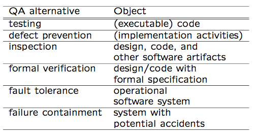
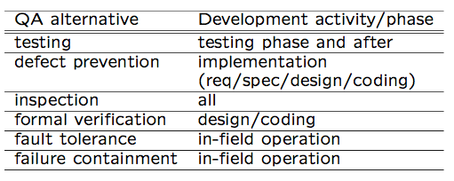
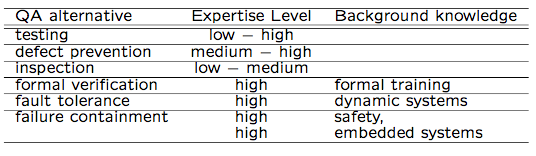
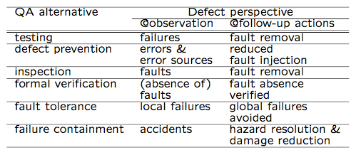
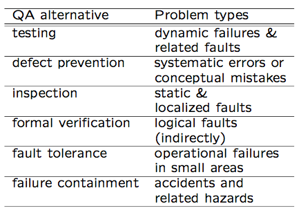
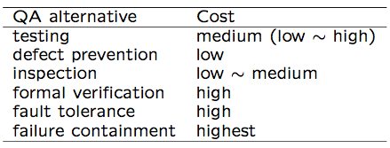
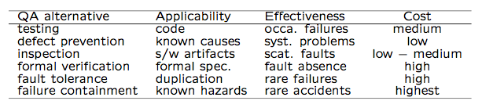

Software Quality Engineering
============================

	Testing, Quality Assurance, and Quantiable Improvement

Tian Siyuan <tiansiyuan@gmail.com>

# Chapter 17. Comparing QA Alternatives

-	General Areas/Questions for Comparison

-	Applicability, Effectiveness, and Cost

-	Summary and Recommendations

# QA Alternatives

-	Defect and QA

	-	Defect: error/fault/failure
	
	-	Defect prevention/removal/containment
	
	-	Map to major QA activities

-	Defect prevention

	- Error source removal & error blocking

-	Defect removal: Inspection/testing/etc

-	Defect containment: Fault tolerance and failure containment (safety assurance)

-	Comparison: This chapter

# Comparison

-	Cost-benefit under given environments

	-	Environments: applicable or not?
	
	-	Cost to perform
	
	-	Benefit: quality, directly or indirectly

-	Testing as the comparison baseline

	-	Most commonly performed QA activity
	
	-	Empirical and internal data for testing
	
	-	QA alternatives compared to testing

		- defect prevention (DP),
		
		- inspection,
		
		- formal verification (FV),
		
		- fault tolerance (FT),
		
		- failure containment (FC)

	-	FT & FC: separate items in comparison

# Comparison: Applicability

-	Applicability questions

	-	High-level questions: 
	
		development vs. field usage (and support/maintenance)

	-	Low level questions: 
	
		development phases/activities

-	Applicability to maintenance

	-	Not applicable: Defect prevention

		(although lessons applied to future)

	-	Applicable to a limited degree: 
	
		Inspection, testing, formal verification, as related to reported field failures

	-	Applicable: 
	
		fault tolerance and failure containment, but designed/implemented during development

-	Our focus: 

	applicability to development

-	Objects QA activities applied on

	-	Mostly on specific objects

		- e.g., testing executable code

	-	Exception: defect prevention on

		(implementation related) dev. activities

-	Summary: Table 17.1 (p.289)

	

-	Applicability to development phases

	-	In waterfall or V-model: implementation

		(requirement/design/coding) & testing/later

	-	Inspection in all phases
	
	-	Other QA in specific sets of phases

-	Summary: Table 17.2 (p.290)

	

-	Applicability to product domain/segment

	-	All QA alternatives can be applied to all domains/segments
	
	-	Other factors: cost-benefit ratio
	
	-	Higher cost needs to be justified by higher payoff/returns
	
	-	Further comparison in connect to cost and effectiveness comparisons

-	Also relate to general context of QA

	-	QA distribution: Fig 4.1 (p.45)
	
	-	Related activities in other phases, e.g., design/implementation for FT/SSE

-	Other process variations: similar to smaller cycles of waterfall

# Comparison: Applicability/Expertise

-	Pre-condition to performing specific QA activities

	-	specific expertise required
	
	-	also related to cost

-	Expertise areas

	-	Specifics about the QA alternative
	
	-	Background/domain-specific knowledge
	
	-	FV: formal training
	
	-	FT: dynamic system behavior
	
	-	FC: embedded system safety
	
	-	Other QA: general CS/SE knowledge

-	General expertise levels: 

	mostly in ranges, depending on specific techniques used

-	Specific background knowledge

-	Summary: Table 17.3 (p.291)

	

# Comparison: Benefit or Effectiveness

-	General benefit questions

	-	Better quality: views and perspectives?
	
	-	Defect-centered view in this book

		=> fewer defects

	-	Defect-related questions below
	
	-	Other benefit: experience, culture change, process improvement, etc

-	Defect related question

	-	Defect specifics: errors/faults/failures
	
	-	Problem or defect types
	
	-	Defect levels or pervasiveness
	
	-	Information for defect drops and quality improves

# Comparison: Effectiveness

-	Defect specifics or perspectives

	-	Dealing with errors/faults/failures?
	
	-	Direct action vs followup action: 
	
		may deal with different defect perspectives
		
	-	Example: 
	
		failures detected in testing but (failure-causing) faults fixed in followup

-	Summary: Table 17.4 (p.292)

	

-	Table 17.5 (p.292) above

	

-	Problem or defect types

	-	errors/faults/failures of different types or characteristics

-	Defect types: Inspection vs. testing

	-	Static analysis vs. dynamic execution

		=> static vs dynamic problems and conceptual/logical problems vs. timing problems

	-	Localized defects easily detected by inspection 
	
		vs. interface/interaction problems detected by testing

-	Defect types: Other QA

	-	defect prevention: negating causes or pre-conditions to pervasive problems

	-	fault tolerance: rare conditions

	-	safety assurance: accidents

	-	FV: logical problems, but indirectly

-	Information for defect decrease and quality improve

-	Result interpretation

	-	specific pieces of info
	
	-	interpret the info./result
	
	-	link to quality, impact, meaning, etc.?

-	Using information/measurement

	-	to provide feedback
	
	-	to guide followup activities
	
	-	to help decision making/improvement
	
	-	goal: defect drops and quality improves

		(usually via analysis/modeling)

	-	Part IV. Quantifiable Improvement: measure-analyze-feedback-improve steps

-	Ease of result interpretation

-	Specific info/measurement

-	All Summarized in Table 17.7 (p.295)

	

# Comparison: Cost

-	Cost measurement/characterization

	-	Direct cost: $

	-	Indirect cost: time, effort, etc

	-	Things affecting cost: simplicity, expertise (already addressed), tools, etc

	-	Cost to perform specific QA activities

-	Factors beyond cost to perform QA

	-	Cost of failures and related damage

	-	Other cost, particularly for defect containment (FT and FC)

	-	Operational cost, e.g., FT mechanisms slow down normal operations

	-	Implementation cost of FT mechanisms

-	Overall cost comparison

	-	rough values and ranges

	-	multiple factors but focus on performing the specific QA activities

-	Table 17.8 (p.297)

	

# Comparison: Summary

-	Testing

	-	Important link in dev. process

	-	Activities spilt over to other phases

		- OP development, test preparation, etc

		- (partial) code exist before testing

	-	Dynamic/run-time/interaction problems

	-	Medium/low defect situations

	-	Techniques and tools

	-	Coverage vs. reliability focus

	-	Cost: moderate

-	Defect prevention

	-	Most effective if causes known

	-	Good at pervasive problems

	-	Low cost, due to downstream damage#

	-	Issue: “if causes", and up-front cost

-	Inspection

	-	Good throughout dev. process

	-	Works on many software artifacts

	-	Conceptual/static faults

	-	High fault density situations

		- non-blocking

		- experience => efficiency improve

	-	Human intensive, varied cost

-	Formal verification

	-	Positive confirmation/correctness

	-	On design/code with formal spec

	-	Low/no defect situations

	-	Practicality: high cost ! benefit?

	-	Human intensive, rigorous training

		(therefore, high up-front cost)

-	Fault tolerance

	-	Dynamic problems (must be rare)

	-	High cost & reliability (low defect)

	-	Technique problems (independent NVP?)

	-	Process/technology intensive

-	Failure containment

	-	Similar to FT above, but even more so

	-	Rare conditions related to accidents

	-	Extremely high cost

		=> apply only when safety matters

	-	Many specialized techniques

	-	Process/technology intensive

# Comparison: Grand Summary

-	Grand summary: Table 17.9 (p.298)

	

-	Pairwise comparison, if needed

-	Different strength/weakness

	=> hybrid/integrated strategies

# Pairwise Comparison

-	Inspection vs. preventive actions

	-	Inspection coupled with causal analysis

	-	Together drive preventive actions

	-	Key difference: error vs fault focus

-	Inspection vs. formal verification

	-	FV ~= formalized inspection

	-	Focus: people vs. mathematical/logical

	-	Applicability to design/code only?

	-	Existence of formal specifications?

	-	Tradeoff: formality vs. cost

	-	Training and acceptability issues

-	Inspection vs. testing

	-	Existence of the implemented product

	-	Levels of quality/defects

	-	Static vs. dynamic defects

	-	Localized vs. interconnected defects

	-	Combined approaches

		- phases and transitions

		- inspection of testing entities/processes

-	Inspection vs. fault tolerance

	-	Complementary instead of competing

		(e.g., inspect individual versions)

	-	Static vs. dynamic

	-	Inspection of FT techniques/mechanisms

-	Other comparisons: Similar to above

# Recommendation: Integration

-	Different QA alternatives often complementary instead of competing to one another

	-	Dealing with different problems

	-	Work in different phases/environments

	-	Combined effect

		=> use multiple QA alternatives together

	-	Shared resource and expertise

-	Integration: Concerted QA effort

	-	As a series of defense (Fig 3.1, p.30)

	-	Satisfy specific product/segment needs

	-	Fit into process and overall environment

	-	Adaptation/customization often needed

	-	Match to organizational culture
