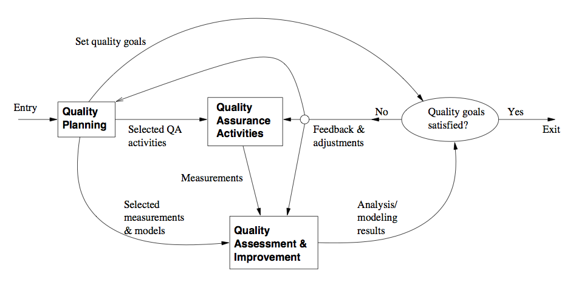
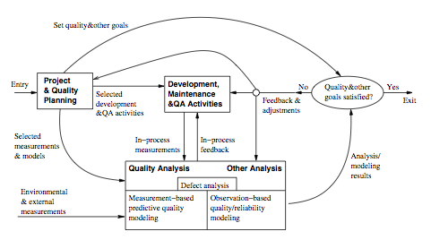
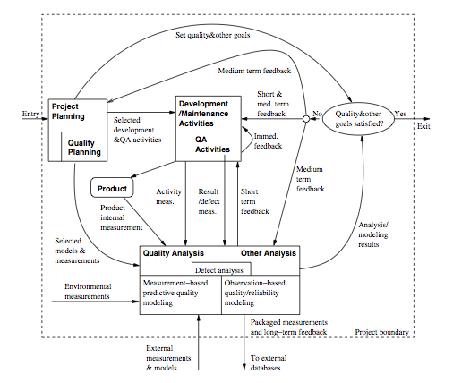

Software Quality Engineering
============================

	Testing, Quality Assurance, and Quantiable Improvement

Tian Siyuan <tiansiyuan@gmail.com>

# Chapter 18. Feedback Loop and Activities for Quantifiable Quality Improvement

-	Feedback Loop and Overall Mechanism
-	Monitoring and Measurement
-	Analysis and Feedback
-	Tool and Implementation Support

# Importance of Feedback Loop

-	All QA activities covered in Part II and Part III need additional support

	-	Planning and goal setting (Chapter 5)
	-	Management via feedback loop

		- When to stop?
		- Adjustment and improvement, etc
		- All based on assessments/predictions

-	Feedback loop for quantification/improvement

	-	Focus of Part IV chapters
	-	Chapter 18: mechanism and implementation
	-	Chapter 19: models and measurements
	-	Chapter 20: defect analyses and techniques
	-	Chapter 21: risk identification techniques
	-	Chapter 22: software reliability engineering

# QE Activities and Process Review

-	Major activities

	-	Pre-QA planning (Chapter 5)
	-	QA (Part II and Part III)
	-	Post-QA analysis & feedback { Part IV

		(maybe parallel instead of "post-")

-	Overall process: Fig 5.1 (p.54)

		- Software quality engineering (SQE)

# QE Activities and Process Review

-	Feedback loop zoom-in: Fig 18.1 (p.304)

	-	Multiple measurement sources
	-	Many types of analysis performed
	-	Multiple feedback paths

# Feedback Loop Related Activities

-	Monitoring and measurement

	-	defect monitoring belongs to process management
	-	defect measurement belongs to defect handling
	-	many other related measurements

-	Analysis modeling

	-	Historical baselines and experience
	-	Choosing models and analysis techniques
	-	Focus on defect/risk/reliability analyses
	-	Goal: assessment/prediction/improvement

-	Feedback and followup

	-	Frequent feedback: assessment/prediction
	-	Possible improvement areas identified
	-	Overall management and improvement

# Quality Monitoring and Measurements

-	Quality monitoring needs

	-	Quality as a quantified entity over time
	-	Able to assess, predict, and control
	-	Various measurement data needed
	-	Some directly in quality monitoring
	-	Others via analyses to provide feedback

-	Direct quality measurements

	-	Result, impact and related info

		- e.g., success vs. failure
		- classification info. (e.g., ODC)

	-	Defect information: directly monitored

		- additional defect analysis in Chapter 20

	-	Mostly used in quality monitoring

# Indirect Quality Measurements

-	Indirect quality measurements: Why?

	-	Other quality measurements (reliability)

		need additional analyses/data

		(See reliability definition in Chapter 22.)

	-	Unavailability of direct quality measure-

		ments early in the development cycle

		=> early (indirect) indicators

	-	Used to assess/predict/control quality
		(to link to or affect various direct quality measurements)

-	Types of indirect quality measurements

	-	Environmental measurements
	-	Product internal measurements
	-	Activity measurements

# Indirect Measurements: Environment

-	Process characteristics

	-	Entities and relationships
	-	Preparation, execution and followup
	-	Techniques used

-	People characteristics

	-	Skills and experience
	-	Roles: planners/developers/testers
	-	Process management and teams

-	Product characteristics

	-	Product/market environment
	-	Hardware/software environment

# Indirect Measurements: Internal

-	Product internal measurements: most studied/understood in SE

-	Software artifacts being measured

	-	Mostly code-related
	-	Sometimes SRS, design, docs etc

-	Product attributes being measured

	-	Control: e.g., McCabe complexity
	-	Data: e.g., Halstead metrics
	-	Presentation: e.g., indentation rules

-	Structures

	-	Unstructured: e.g., LOC
	-	Structured: examples above

# Indirect Measurements: Activity

-	Execution/activity measurements

	-	Overall: e.g., cycle time, total effort
	-	Phased: profiles/histograms
	-	Detailed: transactions in SRGMs

-	Testing activity examples

	-	Timing during testing/usage
	-	Path verification (white-box)
	-	Usage-component mapping (black-box)
	-	Measurement along the path

-	Usage of observations/measurements: observation-based and predictive models

# Immediate Followup and Feedback

-	Immediate (without analyses): Why?

	-	Immediate action needed right away

		- critical problems => immediate fixing
		- most other problems: no need to wait

	-	Some feedback as built-in features in various QA alternatives and techniques
	-	Activities related to immediate actions

-	Testing activity examples

	-	Shifting focus from failed runs/areas
	-	Re-test to verify defect fixing
	-	Other defect-related adjustments

-	Defect and activity measurements used

# Analyses, Feedback, and Followup

-	Most feedback/followup relies on analyses

-	Types of analyses

	-	Product release decision related
	-	For other project management decisions, at the phase or overall project level
	-	Longer-term or wider-scope analyses

-	Types of feedback paths

	-	Shorter vs. longer feedback loops
	-	Frequency and time duration variations
	-	Overall scope of the feedback
	-	Data source refinement
	-	Feedback destinations

# Analysis for Product Release Decisions

-	Most important usage of analysis results

	-	Prominent in Fig 5.1 and Fig 18.1
	-	Related to: "when to stop testing?"

-	Basis for decision making

	-	Without explicit quality assessment

		- implicit: planned activities,
		- indirect: coverage goals,
		- other factors: time/$-based

	-	With explicit quality assessment

		- failure-based: reliability,
		- fault-based: defect count & density

-	Criteria preference: reliability { defect { coverage { activity

# Analyses for Other Decisions

-	Transition from one (sub-)phase to another

	-	Later ones: similar to product release
	-	Earlier ones: reliability undefined

		- defects - coverage - activity,
		- inspection and other early QA

-	Other decisions/management-activities

	-	Schedule adjustment
	-	Resource allocation and adjustment
	-	Planning for post-release support
	-	Planning for future products or updates

-	These are product-level or sub-product-level decisions and activities

# Other Feedback and Followup

-	Other (less frequent) feedback/followup

	-	Goal adjustment (justified/approved)
	-	Self-feedback (measurement & analysis)
		- unsuitable measurements and models?
		- SRE measurement example in IBM

	-	Longer term, project-level feedback
	-	May even carry over to followup projects

-	Beyond a single-project duration/scope

	-	Future product quality improvement
		- overall goal/strategy/model/data,
		- especially for defect prevention

	-	Process improvement
	-	More experienced people

# Feedback Loop Implementation

-	Key question: sources and destinations

	(Analysis and modeling activity at center.)

-	Sources of feedback loop = data sources

	-	Result and defect data

		- the QA activities themselves

	-	Activity data

		- both QA and development activities

	-	Product internal data: product

		(produced by development activities)

	-	Environmental data: environment

-	Additional sources of feedback loop

	-	From project/QA planning
	-	Extended environment: measurement data and models beyond project scope

# Feedback Loop Implementation

-	Feedback loop at different duration/scope levels

-	Immediate feedback to current development activities (locally)

-	Short-term or sub-project-level feedback

	-	most of the feedback/followup in Chapter 18
	-	transition, schedule, resource,
	-	destination: development activities

-	Medium-term or project-level feedback

	-	overall project adjustment and release
	-	destination: major blocks in Fig 5.1

-	Longer-term or multi-project feedback

		- to external destinations

# Feedback Loop Implementation

-	Overall implementation: Fig 18.2 (p.315)

	-	Originated from Fig 5.1
	-	Via intermediate refinement in Fig 18.1

# Implementation Support Tools

-	Type of tools

	-	Data gathering tools
	-	Analysis and modeling tools
	-	Presentation tools

-	Data gathering tools

	-	Defects/direct quality measurements

		- from defect tracking tools

	-	Environmental data: project db
	-	Activity measurements: logs
	-	Product internal measurements
		- commercial/home-build tools

	-	New tools/APIs might be needed

# Implementation Support Tools

-	Analysis and modeling tools

	-	Dedicated modeling tools

		- e.g., SMERFS and CASRE for SRE

	-	General modeling tools/packages
		- e.g., multi-purpose S-Plus, SAS

	-	Utility programs often needed for data screening and processing

-	Presentation tools

	-	Aim: easy interpretation of feedback

		=> more likely to act on

	-	Graphical presentation preferred
	-	Some "what-if"/exploration capability

# Strategy for Tool Support

-	Using existing tools ) cost#

	-	Functionality and availability/cost
	-	Usability
	-	Flexibility and programmability
	-	Integration with other tools

-	Tool integration issues

	-	Assumption: multiple tools used

		(All-purpose tools not feasible/practical.)

	-	External rules for inter-operability,

		- common data format and repository

	-	Multi-purpose tools
	-	Utilities for inter-operability

# Tool Support Example

-	IBM example: Fig 18.3 (p.319)
