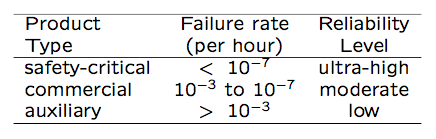
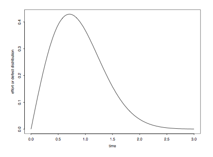
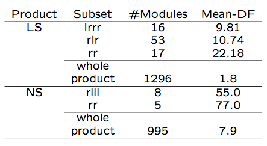
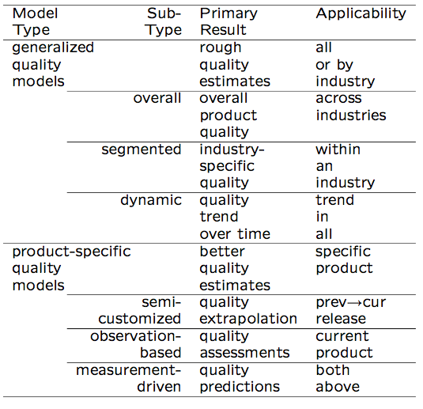
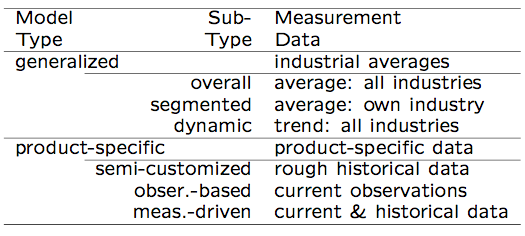
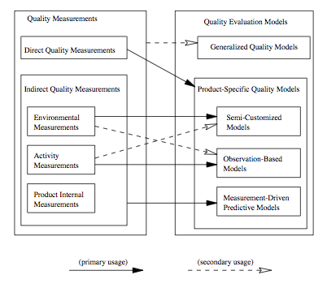
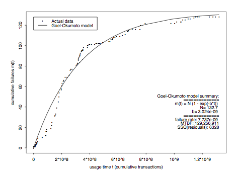

Software Quality Engineering
============================

	Testing, Quality Assurance, and Quantiable Improvement

Tian Siyuan <tiansiyuan@gmail.com>

# Chapter 19. Quality Models and Measurements

-	Types of Quality Assessment Models
-	Comparing Quality Assessment Models
-	Data Requirements and Measurement
-	Measurement and Model Selection

# QA Data and Analysis

-	Generic testing process

	-	Test planning and preparation
	-	Execution and measurement
	-	Test data analysis and followup
	-	Related data => quality => decisions

-	Other QA activities

	-	Similar general process
	-	Data from QA/other sources (Chapter 18)
	-	Models used in analysis and followup
	
		- provide timely feedback/assessment
		- prediction, anticipating/planning
		- corrective actions => improvement

# QA Models and Measures

-	General approach

	-	Adapt GQM-paradigm
	-	Quality: basic concept and ideas
	-	Compare models => taxonomy
	-	Data requirements => measurements
	-	Practical selection steps
	-	Illustrative examples

-	Quality attributes and definitions

	-	Q models: data => quality
	-	Correctness vs. other attributes
	-	Our definition/restriction: being defect-free or of low-defect
	-	Examples: reliability, safety, defect count/density/distribution/etc

# Quality Analysis

-	Analysis and modeling

	-	Quality models: data => quality

		- a.k.a. quality assessment models or quality evaluation models

	-	Various models needed
	-	Assessment, prediction, control
	-	Management decisions
	-	Problematic areas for actions
	-	Process improvement

-	Measurement data needed

	-	Direct quality measurements: success/failure (& defect info)
	-	Indirect quality measurements

		- activities/internal/environmental

	-	Indirect but early quality indicators
	-	All described in Chapter 18

# Quality Models

-	Practical issues

	-	Applicability vs. appl. environment
	-	Goal/Usefulness: information/results?
	-	Data: measurement data required
	-	Cost of models and related data

-	Type of quality models

	-	Generalized: averages or trends
	-	Product-specific: more customized
	-	Relating to issues above

# Generalized Models

	Overall Generalized Quality Evaluation Models 

-	Model taxonomy: Fig 19.1 (p.324)

	

	-	Generalized

		- overall, segmented, and dynamic

	-	Product-specific

		- semi-customized: product history
		- observation-based: observations
		- measurement-driven: predictive

# Generalized Models: Overall

-	Key characteristics

	-	Industrial averages/patterns

		=> (single) rough estimate

	-	Most widely applicable
	-	Low cost of use

-	Examples: Defect density

	-	Estimate total defect with sizing model
	
	-	Variation: QI in IBM

		(counting in-field unique defect only)

-	Non-quantitative overall models

	-	As extension to quantitative models
	-	Examples: 80:20 rule, and other general observations

# Generalized Models: Segmented

-	Key characteristics

	-	Estimates via product segmentation
	-	Model: segment -> quality
	-	Multiple estimates provided

-	Example: Table 19.1 (p.326)

	

-	Other applications

	-	Commonly used in software estimation
	-	Example: COCOMO models

# Generalized Models: Dynamic

-	Example: Putnam model Fig 19.2 (p.326)

	

	Rayleigh curve for failure rate: r = 2Bate\*\*(at**(2))

-	Overall/average trend over time

	-	Often expressed as a mathematical

		function or an empirical curve

	-	Combined models possible, e.g., segmented dynamic models

# Product-Specific Models (PSM)

-	Product-specific models (PSMs)

	-	Product-specific information used

		(vs. none used in generalized models)

	-	Better accuracy/usefulness at cost increase
	
	-	Three types

		- semi-customized
		- observation-based
		- measurement-driven predictive

-	Connection to generalized models (GMs)

	-	Customize GMs to PSMs with new/refined models and additional data
	-	Generalize PSMs to GMs with empirical evidence and general patterns
	-	Illustrated in Fig 19.1 (p.324)

# PSM: Semi-Customized

-	Semi-customized models

	-	Project level model based on history
	-	Data captured by phase
	-	Both projections and actual
	-	Linear extrapolation

-	Example: DRM in Table 19.2 (p.327)

	

-	Related extensions to DRMs

	-	Defect dynamics model in Chapter 20,
	-	ODC defect analyses in Chapter 20

		- 1-way distribution/trend analysis
		- 2-way analysis of interaction

# PSM: Observation-Based

-	Observation-based models

	-	Detailed observations and modeling
	-	Software reliability growth models
	-	Other reliability/safety models

-	Model characteristics

	-	Focus on the effect/observations
	-	Assumptions about the causes
	-	Assessment-centric
	-	Example: Goel-Okumoto NHPP SRGM
		- functional relation: m(t) = N (1 - e ** (-bt))
		- observed failures over time
		- curve fitting
		- reliability assessment/prediction
		- management decisions: exit criteria

# PSM: Predictive

-	Measurement-driven predictive models

	-	Establish predictive relations
	-	Modeling techniques: regression, TBM, NN, OSR etc
	-	Risk assessment and management

-	Model characteristics

	-	Response: chief concern
	-	Predictors: observable/controllable
	-	Linkage quantification

# PSM: Predictive Model Example

-	Example: Table 19.3 (p.329)

	

	-	tree-based defect modeling
	-	substantially different high-risk areas
	-	identification and remedial actions

# Model Summary

-	Summary: Table 19.4 (p.329)

	

# Model Applications

-	Applications

	-	not data => GMs as early choices
	-	Data arrival => phase in PSMs

		- special case: historical data

		  => semi-customized models

	-	Model customization within application

-	Model customization (from generalized to product-specific) in connection with model applications

-	Model generalization

	-	data/results accumulation
	-	generalized model possible?
	-	mathematical function/empirical trend

# Relating Models to Measurements

-	Data (Chapter  18) required by quality models

	-	Direct quality measurements

		- to be assessed/predicted/controlled

	-	Indirect quality measurements

		- means to achieve the goal
		- environmental, activity, product-internal

	-	Data requirement by models: summarized in Table 19.5 (p.331)

	

-	Data requirement of GMs

	-	Quality averages/patterns: Q
	-	No measurements from current project

-	Data requirement of PSMs

	-	All use direct quality measurements: Q

		- related to other measurements: M
		- as relations: Q ~ M
		- or as functions: Q = f (M)
		
	-	Measurement-driven models

		- M = all measurements
		
	-	Semi-customized models

		- M = environmental measurements

	-	Observation-based models

		- M = activity measurements
		
	-	Various other secondary uses

# Relating Models to Measurements Quality Measurements

-	Relating models to measurements: Fig 19.3 (p.332) - chapter summarized

	

-	Can also be examined from the direction of measurements-models forward links

# Model/Measurement Selection

-	Customize GQM into 3-steps

-	Step 1: Quality goals

	-	Restricted, not general goals

-	Step 2: Quality models

	-	Model characteristics/taxonomy
	-	Model applicability/usefulness
	-	Data requirement/affordability

-	Step 3: Quality measurements

	-	Model-measurements relations
	-	Detailed model information

# Selection Example A

-	Goal: rough quality estimates

-	Situation 1

	-	No product specific data
	-	Industrial averages/patterns
	-	Commercial tools: SLIM etc
	-	Product planning stage
	-	Defect profile in lifecycle
	-	Use generalized models

-	Situation 2

	-	Data from related products
	-	DRM for legacy products
	-	ODC profile for IBM products
	-	Semi-customized models

# Selection Example B

-	Goal: customer-view of quality in system testing

-	Quality model

	-	SRGMs: info. about reliability
	-	Assessment: customer-view
	-	Prediction: project management
	-	Decisions: exit criteria
	-	Affordability: data and modeling

-	Quality measurements

	-	Reliability: failure-free operation for a given time under a specific environment
	-	Result: success/failure measurement
	-	Time measurement: re(cid:13)ect activity
	-	Environment: implicitly assumed

# Selection Example B

-	Fig 19.4 (p.335): SRGM, an observation-based model, selected for Example B

	

	-	reliability assessed/predicted
	-	time = transactions

# Selection Example C

-	Goal: testing process/quality improvement, but SRGMs inadequate

-	Selecting TBRM in Fig 19.5 (p.336) to focus on reliability improvement

# Selection Example C

-	TBRM: improvement focus

	- what’s wrong: risk identification
	- what to do: remedial actions

-	Data attributes: Table 19.6 (p.336)

	-	Result: success/failure measurement
	-	Timing info.: time-domain analysis
	-	Input state: input-domain analysis

		Timing: 
		
			calendar date (year, month, day), tday (cumulative testing days since the start of testing), and rsn (run sequence number, uniquely identifies a run in the execution sequence).

		Input state: 
		
			SC (scenario class), SN (scenario number), log (corresponding to a sub-product with a separate test log) and tester.

		Result: 
		
			result indicator of the test run, with 1 indicating success and 0 indicating failure.

# Summary and Perspectives

-	Practical need for quality measurement and model selection

-	Viable approach

	-	Model characteristics => taxonomy
	-	Model data requirement: different types of quality measurements
	-	Selection steps: customized GQM
	-	Viability: examples

-	Perspective and future work

	-	Refined taxonomy
	-	Relating models to measurements

		- more details and specific info

	-	Lifecycle activities and support
	-	Automation?
