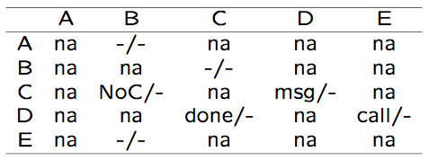
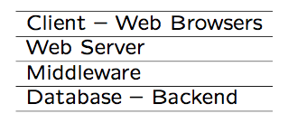
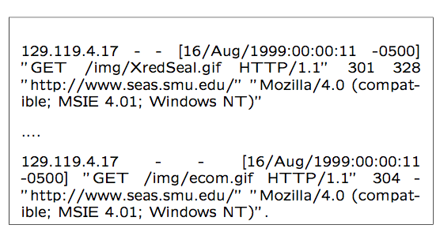
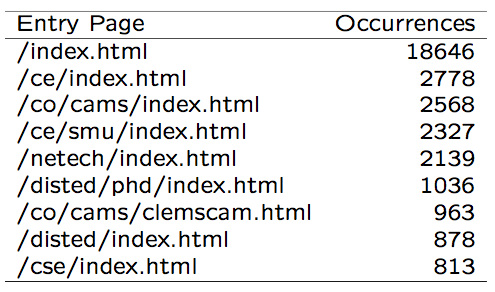
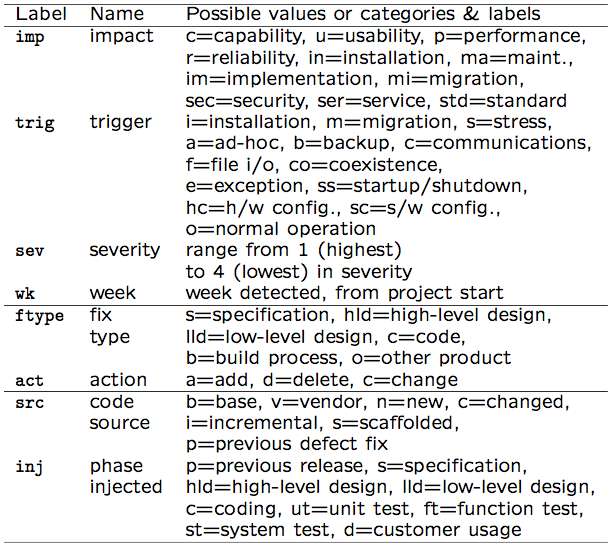
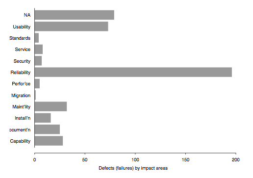
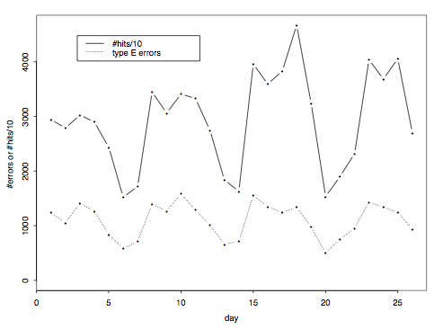
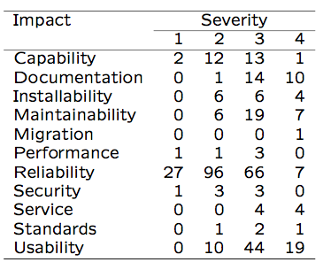

Software Quality Engineering
============================

	Testing, Quality Assurance, and Quantiable Improvement

Tian Siyuan <tiansiyuan@gmail.com>

# Chapter 20. Defect Classification and Analysis

-	General Types of Defect Analyses
-	ODC: Orthogonal Defect Classification
-	Analysis of ODC Data

# Defect Analysis

-	Goal: (actual/potential) defect decrease or quality improve in current and future products

-	General defect analyses

	-	Questions: what/where/when/how/why?
	-	Distribution/trend/causal analyses

-	Analyses of classified defect data

	-	Prior: defect classification
	-	Use of historical baselines
	-	Attribute focusing in 1-way and 2-way analyses
	-	Tree-based defect analysis (Chapter 21)

# Defect in Quality Data/Models

-	Defect data is part of quality measurement data

	-	As part of direct Q data
	-	Extracted from defect tracking tools
	-	Additional (defect classification) data may be available

-	Defect data in quality models

	-	As results in generalized models (GMs)
	-	As r.v. (response/independent variable) in product specific models (PSMs)
		- semi-customized models ~= GMs,
		- observation-based: r.v. in SRGMs,
		- predictive: r.v. in TBDMs
		- (SRGMs/TBDMs in Chapter 22/21.)

# General Defect Analysis

-	General defect analyses: Questions

	-	What? identification (and classification)

		- type, severity, etc.,
		- even without formal classification

	-	Where? distribution across location
	-	When? discovery/observation

		- what about when injection? harder
		- pre-release: more data
		- post-release: more meaningful/sensitive

	-	How/why? related to injection

		=> use in future defect prevention

-	General defect analyses: Types

	-	Distribution by type or area
	-	Trend over time
	-	Causal analysis
	-	Other analysis for classified data

# Defect Analysis: Data Treatment

-	Variations of defect data

	-	Error/fault/failure perspective
	-	Pre-/post-release
	-	Unique defect?
	-	Focus here: defect fixes

-	Why defect fixes (DF)

	-	Propagation information
	-	Close ties to effort (defect fixing)
	-	Pre-release: more meaningful

		(post release: each failure occurrence.)

# Defect Distribution Analysis

-	Distribution: what, where, etc

-	What: Distribution over defect types

	-	Ties to quality views/attributes (Chapter 2)
	-	Within specific view: types/sub-types
	-	Defect types ( product’s \domain"
	-	IBM example: CUPRIMDSO

-	Important observation

	-	Skewed distribution, or 80:20 rule

		=> importance of risk identification for effective quality improvement

	-	Early indicators needed!

		(Cannot wait after defect discoveries.)

# Defect Distribution Analysis

-	Web example: Table 20.1 (p.341)

	-	defect = "error" in web community
	-	dominance of type E "missing files"
	-	type A: further information needed
	-	all other types: negligible

# Defect Distribution Analysis

-	Further analysis of web example above

	-	for dominant type E "missing files"
	-	web error distribution by file type

		- Table 20.2 (p.342)

	-	again, skewed distribution!

# Defect Distribution Analysis

-	Where: Distribution over locations

	-	commonly by product areas

		- sub-product/module/procedure/etc

	-	IBM-LS: Table 20.3 (p.342) above
	-	again, skewed distribution

# Defect Distribution Analysis

-	IBM-NS: Table 20.4 (p.343) above

		- yet another skewed defect distribution

-	Extension: distribution by other locators

		- e.g., types of sources or code, etc

# Defect Trend Analysis

-	Trend as a continuous function

	-	Similar to Putnam model (Chapter 19)
		- but customized with local data

	-	Other analysis related to SRE

		- defect/effort/reliability curves
		- more in Chapter 22 and related references

	-	Sometimes discrete analysis may be more meaningful (see below)

-	Defect dynamics model

	-	Important variation to trend analysis
	-	Defect categorized by phase
	-	Discovery (already done)
	-	Analysis to identify injection phase

# Defect Trend Analysis

-	Defect dynamics model: Table 20.5 (p.344)

	-	row: where (phase) injected
	-	column: where (phase) removed/discovered
	-	focus out-of-phase/off-diagonal ones!

# Defect Causal Analysis

-	Defect causal analyses: Types

	-	Causal relation identified

		- error-fault vs fault-failure
		- works backwards

	-	Techniques: statistical or logical

-	Root cause analysis (logical)

	-	Human intensive
	-	Good domain knowledge
	-	Fault-failure: individual and common
	-	Error-fault: project-wide effort focused on pervasive problems

-	Statistical causal analysis

-	risk identification techniques in Chapter 21

# ODC: Overview

-	Development

	-	Chillarege et al. at IBM
	-	Applications in IBM Labs and several other companies

	-	Recent development and tools

-	Key elements of ODC

	-	Aim: tracking/analysis/improve
	-	Approach: classification and analysis
	-	Key attributes of defects
	-	Views: both failure and fault
	-	Applicability: inspection and testing
	-	Analysis: attribute focusing
	-	Need for historical data

# ODC: Why?

-	Statistical defect models

	-	Quantitative and objective analyses
	-	SRGMs (Chapter 22), DRM (Chapter 19), etc
	-	Problems: accuracy & timeliness

-	Causal (root cause) analyses

	-	Qualitative but subjective analyses
	-	Use in defect prevention

-	Gap and ODC solution

	-	Bridge the gap between the two
	-	Systematic scheme used
	-	Wide applicability

# ODC: Ideas

-	Cause-effect relation by type

	-	Different types of faults
	-	Causing different failures
	-	Need defect classification
	-	Multiple attributes for defects

-	Good measurement

	-	Orthogonality (independent view)
	-	Consistency across phases
	-	Uniformity across products

-	ODC process/implementation

	-	Human classification
	-	Analysis method and tools
	-	Feedback results (and followup)

# ODC: Theory

-	Semantic classification

	-	defect classes for a product
	-	related-to/explain process
	-	akin to event measurement
	-	sufficient condition

		- spanning set over process
		- formed by defect attributes

-	Classification for cause-effect or views

	-	cause: type, trigger, etc
	-	effect: severity, impact, etc
	-	failure vs fault (internal cause) views
	-	additional causal-analysis-related: source, where/when injected

	-	sub-population: environment data

# ODC Example: Table 20.6 (p.347)

# ODC Attributes: Failure-View

-	Defect trigger

	-	Associated with verification process
		- similar to test case measurement
		- collected by testers

	-	Trigger classes

		- product specific
		- black box in nature
		- pre/post-release triggers

-	Other attributes

	-	Impact: e.g., IBM’s CUPRIMDSO
	-	Severity: low-high (e.g., 1-4)
	-	Detection time, etc

# ODC Attributes: Cause/Fault-View

-	Defect type

	-	Associated with development process
	-	Missing or incorrect
	-	Collected by developers
	-	May be adapted for other products

-	Other attributes

	-	Action: add, delete, change
	-	Number of lines changed, etc

# ODC Attributes: Cause/Error-View

-	Key attributes

	-	Defect source: vendor/base/new code
	-	Where injected
	-	When injected

-	Characteristics

	-	Associated to additional causal analysis
	-	(May not be performed.)
	-	Many subjective judgment involved

		(evolution of ODC philosophy)

-	Phase injected: rough "when"

# Adapting ODC for Web Error Analysis

-	Continuation of web testing/QA study

-	Web error = observed failures, with causes already recorded in access/error logs

-	Key attributes mapped to ODC

	-	Error type = defect impact

		- types in Table 20.1 (p.341)
		- response code (4xx) in access logs

	-	Referring page = defect trigger

		- individual pages with embedded links
		- classified: internal/external/empty
		- focus on internal problems

	-	Missing file type = defect source

		- different fixing actions to follow

-	May include other attributes for different kinds of web sites

# ODC Analysis: Attribute Focusing

-	General characteristics

	-	Graphical in nature
	-	1-way or 2-way distribution
	-	Phases and progression
	-	Historical data necessary
	-	Focusing on big deviations

-	Representation and analysis

	-	1-way: histograms
	-	2-way: stack-up vs. multiple graphics
	-	Support with analysis tools

# ODC Analysis Examples

-	1-way analysis: Fig 20.1 (p.349)

	-	Defect impact distribution for an IBM product

	-	Uneven distribution of impact areas!

		=> risk identification and focus

# ODC Analysis Examples

-	1-way analysis: Fig 20.2 (p.350)

	-	web error trend analysis
	-	context: compare to usage (reliability)
	-	stable operational reliability

# ODC Analysis Examples

-	2-way analysis: Table 20.7 (p.351)

	-	Defect impact-severity analysis
	-	IBM product study continued
	-	Huge contrast: severity of reliability and usability problems!

# ODC Process and Implementation

-	ODC process

	-	Human classification

		- defect type: developers,
		- defect trigger and effect: testers,
		- other information: coordinator/other

	-	Tie to inspection/testing processes
	-	Analysis: attribute focusing
	-	Feedback results: graphical

-	Implementation and deployment

	-	Training of participants
	-	Data capturing tools
	-	Centralized analysis
	-	Usage of analysis results

# Linkage to Other Topics

-	Development process

	-	Defect prevention process/techniques
	-	Inspection and testing

-	Testing and reliability

	-	Expanded testing measurement

		- Defects and other information
		- Environmental (impact)
		- Test case (trigger)
		- Causal (fault)

	-	Reliability modeling for ODC classes
