Software Quality Engineering
============================

	Testing, Quality Assurance, and Quantiable Improvement

Tian Siyuan <tiansiyuan@gmail.com>

# Chapter 22. Software Reliability Engineering

-	Concepts and Approaches
-	Existing Approaches: SRGMs & IDRMs
-	Assessment & Improvement with TBRMs
-	SRE Perspectives

# What Is SRE

-	Reliability: Probability of failure-free operation for a specific time period or input set under a specific environment

	-	Failure: behavioral deviations
	-	Time: how to measure?
	-	Input state characterization
	-	Environment: OP

-	Software reliability engineering:

	-	Engineering (applied science) discipline
	-	Measure, predict, manage reliability
	-	Statistical modeling
	-	Customer perspective:

		- failures vs. faults
		- meaningful time vs. development days
		- customer operational profile

# Assumption: SRE and OP

-	Assumption 1: OP, to ensure software reliability from a user’s perspective.

-	OP: Operational Profile

	-	Quantitative characterization of the way a (software) system will be used.
	-	Test case generation/selection/execution
	-	Realistic assessment
	-	Predictions (minimize discontinuity)

-	OP topics in SQE book:

	-	Chapter 8: Musa’s OP

		- flat list with probabilities
		- tree-structured OP
		- dev. procedures: Musa-1/Musa-2

	-	Chapter 10: Markov chains and UMMs (unified Markov models)

# Other Assumptions in Context

-	Assumption 2: Randomized testing

	-	Independent failure intervals/observations
	-	Approximation in large software systems
	-	Adjustment for non-random testing

		=> new models or data treatments

-	Assumption 3: Failure-fault relation

	-	Failure probability ~ # faults
	-	Exposure through OP-based testing
	-	Possible adjustment?
	-	Statistical validity for large s/w systems

-	Assumption 4: time-reliability relation

	-	time measurement in SRGMs
	-	usage-dependent vs. usage-independent
	-	proper choice under specific env.

-	Usage-independent time measurement:

	-	calendar/wall-clock time
	-	only if stable or constant workload

-	Usage-dependent time measurement:

	-	for systems with uneven workload
	-	execution time { Musa’s models
	-	alternatives: runs, transactions, etc.

# Workload for Products D

-	Fig 22.1 (p.374): IBM product D workload

	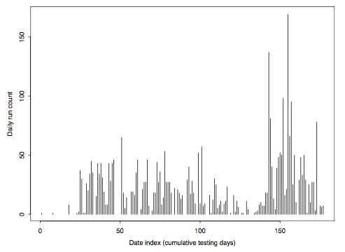

	-	number of test runs for each day
	-	wide variability
	-	need usage-dependent time measurement

		- number of runs used

# Workload for Products E

-	Fig 22.2 (p.375): IBM product E workload

	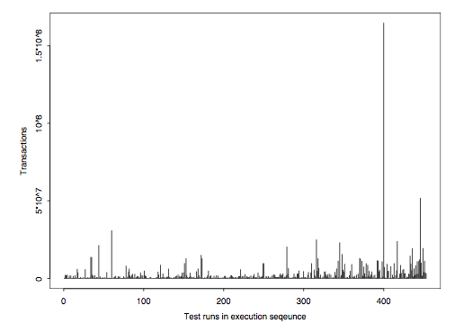

	-	number of transactions for each run
	-	again, wide variability
	-	need usage-dependent time measurement

		- number of transactions used

# Input Domain Reliability Models

-	IDRMs: Current reliability snapshot based on observed testing data of n samples.

-	Assessment of current reliability.

-	Prediction of future reliability

	(limited prediction due to snapshot)

-	Management and improvement

	-	As acceptance criteria.
	-	Risk identification and followups:

		- reliability for input subsets
		- remedies for problematic areas
		- preventive actions for other areas

# Nelson’s IDRM

-	Nelson Model:

	-	Running for a sample of n inputs.
	-	Randomly selected from set E:

		E = { Ei : i = 1; 2; ... ; N }

	-	Sampling probability vector:

		{ Pi : i = 1; 2; ... ; N }

	-	fPig: Operational profile.
	-	Number of failures: f .
	-	Estimated reliability:

		R = 1 - r = 1 - f/n = (n - f)/n

	-	Failure rate: r.

-	Repeated sampling without fixing.

# IDRM Applications

-	Nelson model for a large s/w system

	- succ. segments: Table 22.1 (p.376)

	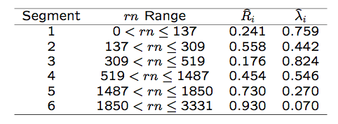

-	Nelson model for web applications

	- daily error rates: Table 22.2 (p.377)

	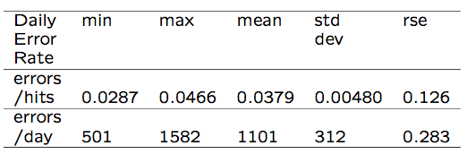

# Other IDRMs and Applications

-	Brown-Lipow model:

	-	explicit input state distribution.
	-	known probability for sub-domains Ei
	-	fi failures for ni runs from subdomain Ei

	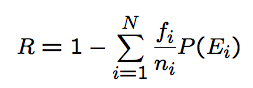

	-	would be the same as Nelson model for representative sampling

-	IDRM applications

	-	overall reliability at acceptance testing
	-	reliability snapshots over time: in Nelson model examples earlier

	-	reliability for input subsets: in TBRMs

# Time Domain Measures and Models

-	Reliability measurement

	-	Reliability: time & probability
	-	Result: failure vs. success
	-	Time/input measurement
	-	Failure intensity (rate): alternative
	-	MTBF/MTTF: summary measure

-	S/W reliability growth models (SRGMs):

	-	Reliability growth due to defect removal based on observed testing data.

	-	Reliability-fault relations
	-	Exposure assumptions
	-	Data: time-between-failure (TBF) vs. period-failure-count (PFC) models

# Basic Functions (Time Domain)

-	Failure distribution functions:

	-	F (t): cumulative distribution function

		(cdf) for failure over time

	-	f (t): prob. density function (pdf)

		f (t) = F'(t)

-	Reliability-related functions:

	-	Reliability functio R(t) = 1 - F (t)

		R(t) = P (T >= t) = P (no failure by t)

	-	Hazard function/rate/intensity

	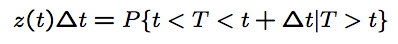

-	Jelinski-Moranda (de-eutrophication) model:

	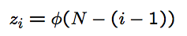

# Other Basic Definitions

-	MTBF, MTTF, and reliability

	-	Mean time to failure (MTTF)

	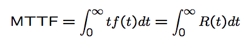

	-	Mean time between failures (MTBF)

		= MTTF for memoryless process

		- similarly defined

	-	good summary measure of reliability

-	Reliability-hazard relation:

	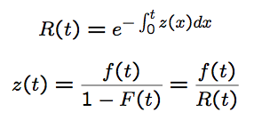

# Other Basic Functions

-	Overall failure arrival process:

	(as compared to individual failures)

-	NHPP (non-homogeneous Poisson process):

	-	Most commonly used for modeling
	-	Probability of n failures in [0; t]:

	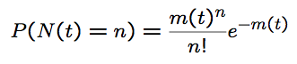

	-	m(t): mean function
	-	Failure rate/intensity >=(t):

	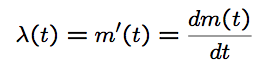

-	Other processes: Binomial, etc.

# Commonly Used NHPP Models

-	Goel-Okumoto model

	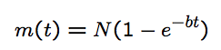

	- N : estimated number of defects
	- b: model curvature

-	S-shaped model:

	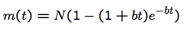

	- allow for slow start
	- may be more descriptive

-	Musa-Okumoto execution time model:

	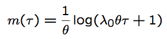

	- emphasis: execution time T

# SRGM Applications

-	Assessment of current reliability

-	Prediction of future reliability and resource to reach reliability goals

-	Management and improvement

	-	Reliability goals as exit criteria
	-	Resource allocation (time/distribution)
	-	Risk identification and followups:

		- reliability (growth) of different areas
		- remedies for problematic areas
		- preventive actions for other areas

# SRGM Application Example

-	SRGM example: Fig. 22.3 (p.380)

	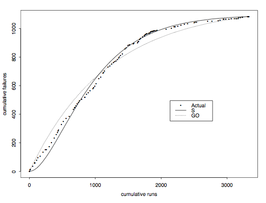

	-	IBM product D, number of runs as workload
	-	Goel-Okumoto (GO) and S-shape SRGMs

# Assessing Existing Approaches

-	Time domain reliability analysis:

	-	Customer perspective.
	-	Overall assessment and prediction.
	-	Ability to track reliability change.
	-	Issues: assumption validity.
	-	Problem: how to improve reliability?

-	Input domain reliability analysis:

	-	Explicit operational profile.
	-	Better input state definition.
	-	Hard to handle change/evolution.
	-	Issues: sampling and practicality.
	-	Problem: realistic reliability assessment?

# TBRMs: An Integrated Approach

-	Combine strengths of the two.

-	TBRM for reliability modeling:

	-	Input state: categorical information.
	-	Each run as a data point.
	-	Time cutoff for partitions.
	-	Data sensitive partitioning

		=> Nelson models for subsets.

-	Using TBRMs:

	-	Reliability for partitioned subsets.
	-	Use both input and timing information.
	-	Monitoring changes in trees.
	-	Enhanced exit criteria.
	-	Integrate into the testing process.

# TBRMs

-	Tree-based reliability models (TBRMs): TBM using all information.

-	Response: Result indicator rij.

	-	rij = 1 for success, 0 for failure.
	-	Nelson model for subsets:

	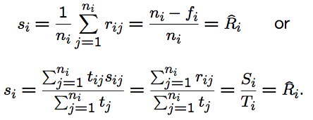

-	Predictors: Timing and input states.

	-	Data sensitive partitioning.
	-	Key factors affecting reliability.

# TBRMs: Interpretation & Usage

-	Interpretation of trees:

	-	Predicted response: success rate.

		(Nelson reliability estimate.)

	-	Time predictor: reliability change.
	-	State predictor: risk identification.

-	Change monitoring and risk identification:

	-	Change in predicted response.
	-	Through tree structural change.
	-	Identify high risk input state.
	-	Additional analyses often necessary.
	-	Enhanced test cases or components.

# TBRMs at Different Times

-	Fig 22.4 (p.383): an early TBRM.

	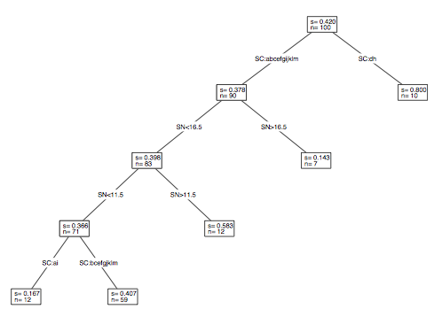

	-	high-risk areas identified by input
	-	early actions to improve reliability

# TBRMs at Different Times

-	Fig 22.5 (p.383): a late TBRM.

	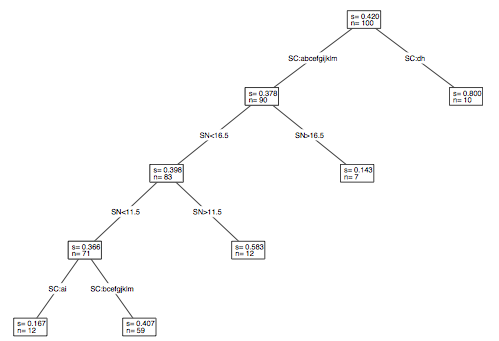

	-	high-risk areas ~= early runs
	-	uniformly reliable => ready for release

# TBRM Impact

-	Evaluation/validation with SRGMs:

	-	Trend of reliability growth.
	-	Stability of failure arrivals.
	-	Estimated reliability: see below

-	Quantitative impact evaluation:

	-	Product purity level (cid:26) at exit:

	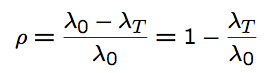

-	Important: deployment

	- all successor products at IBM

# TBRM Result Comparison

-	Fig 22.6 (p.384): TBRMs used in D

	

	-	better reliability growth in D
	-	compare to A, B, and C (no TBRMs)

# TBRM Result Comparison

-	Table 22.3 (p.384):

quantitative comparison with p

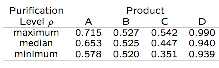

Where:

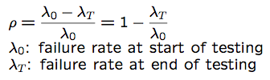

# Integrated Approach: Implementation

-	Modified testing process:

	-	Additional link for data analysis.
	-	Process change and remedial actions.

-	Activities and Responsibilities:

	-	Evolutionary, stepwise refinement.
	-	Collaboration: project & quality orgs.
	-	Experience factory prototype (Basili).

-	Implementation:

	-	Passive tracking and active guidance.
	-	Periodic and event-triggered.
	-	S/W tool support

# Implementation Support

-	Types of tool support:

	-	Data capturing

		- mostly existing logging tools
		- modified to capture new data

	-	Analysis and modeling

		- SMERFS modeling tool
		- S-PLUS and related programs

	-	Presentation/visualization and feedback

		- S-PLUS and Tree-Browser

-	Implementation of tool support:

	-	Existing tools: minimize cost

		- internal as well as external tools

	-	New tools and utility programs
	-	Tool integration

		- loosely coupled suite of tools
		- connectors/utility programs

	-	Overall strategy: Chapter 18 (Section 18.4)

# SRE Perspectives

-	New models and applications

	-	Expand from "medium-reliable" systems.
	-	New models for new application domains.
	-	Data selection/treatment

-	Reliability improvement

	-	Followup to TBRMs
	-	Predictive (early!) modeling for risk identification and management

-	Other SRE frontiers:

	-	Coverage/testing and reliability
	-	Reliability composition and maximization
